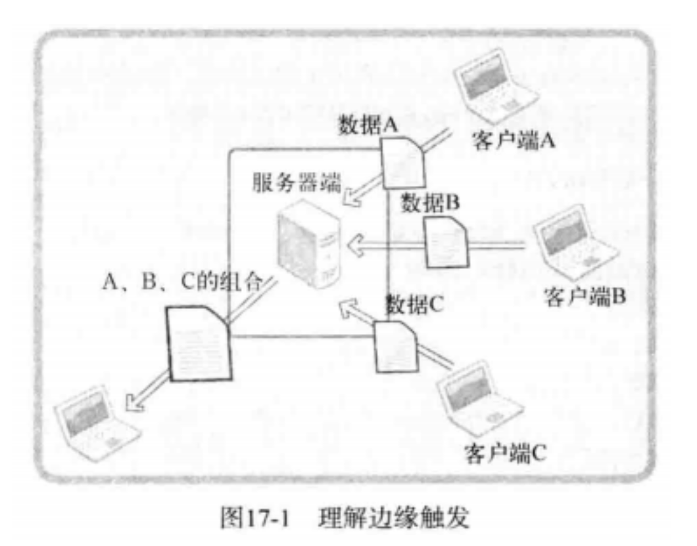
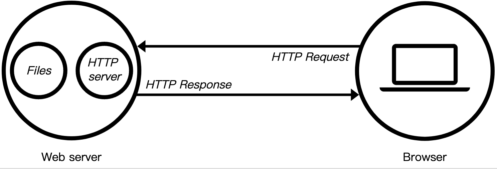
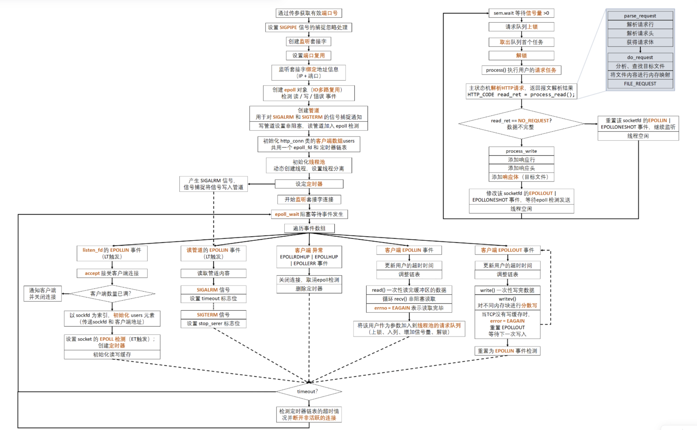
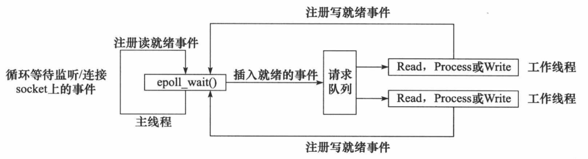
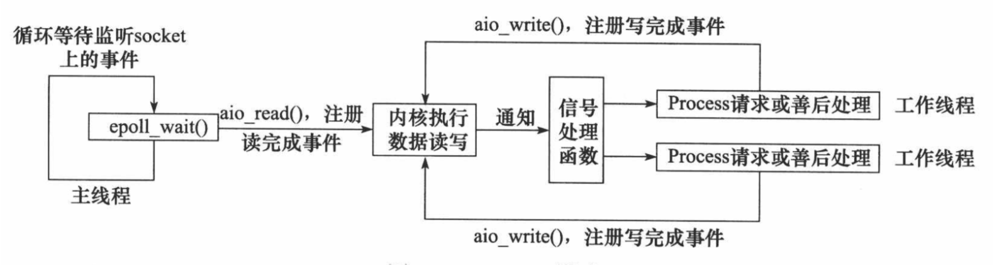
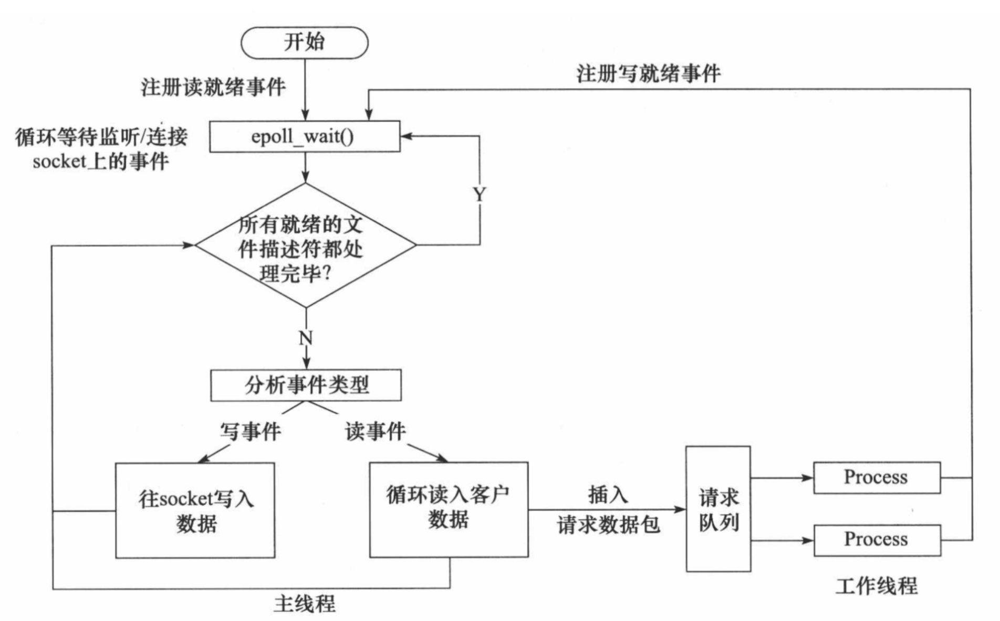
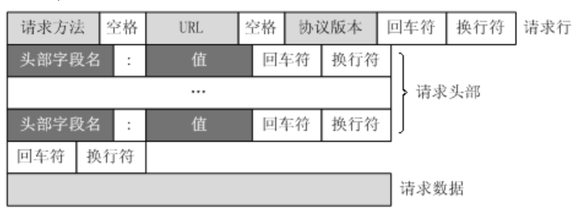
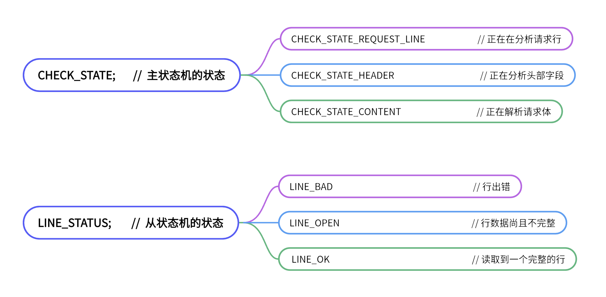

# Linux 轻量级高并发 Web 服务器


## 功能简介

Linux 轻量级高并发 Web 服务器

**项目介绍**

在 Linux 环境下使用 C++ 搭建轻量级高并发 Web 服务器，支持一定数量的客户端连接并及时响应

**内容**

使用**同步 I/O** 方法和线程池类模拟 **Proactor 模**式实现服务器高并发处理

使用 **epoll 边缘触发模式**实现 I/O 多路复用，利用双向链表管理**定时器**及时关闭不活跃的用户

通过使用**有限状态机**，实现对 HTTP 请求的读取和解析，从而实现服务端和客户端之间的通信


## 预备知识

[TCP/IP网络编程](https://github.com/tangling123/TCP-IP-socket-Programming)


### 1. epoll 理解及应用

select 复用方法由来已久，因此，利用该技术后，无论如何优化程序性能也无法同时介入上百个客户端。这种 select 方式并不适合以 web 服务器端开发为主流的现代开发环境，所以需要学习 Linux 环境下的 epoll


**基于 select 的 I/O 复用技术速度慢的原因**

> select函数是一种**I/O多路复用技术**，用于同时监视多个文件描述符的状态。尽管select函数可以用于同时监视多个文件描述符，但它在实际应用中可能会受到一些限制，导致它的性能相对较慢。以下是一些可能导致select**函数性能较慢的原因❤️**：
>
> 1. **每次调用select都需要将监视列表从用户空间拷贝到内核空间，这个过程可能会带来较大的开销。对于大量文件描述符的情况下，这种开销会显得尤为明显。** 
> 2. **select函数只能同时监视一定数量的文件描述符，这个数量通常被限制在1024个左右。如果需要监视更多的文件描述符，则需要通过多次调用select函数来完成，这会导致额外的开销**。
> 3. **select函数返回时需要遍历整个监视列表，以确定哪些文件描述符发生了事件。如果监视列表非常大，这个过程会非常耗时，从而影响整个系统的性能。**
> 4. **select函数支持的事件类型有限，只能监视读、写和异常事件，而不能监视其他类型的事件，如定时器事件等。如果需要监视其他类型的事件，就需要使用其他技术，如epoll或kqueue。**
>
> 总的来说，虽然select函数是一种比较常见的I/O多路复用技术，但它在某些场景下可能会受到一些限制，导致其性能相对较慢。因此，在实际应用中，需要根据具体情况选择最适合的I/O多路复用技术。


基于 select 的 I/O 复用技术服务端，其中有不合理的设计如下：

- 调用 select 函数后常见的针对所有文件描述符的循环语句

  ```c++
  for (int i = 0; i <= fd_max; i++)	//54 lines
      if (FD_ISSET(i, &temp))		    //56 lines
  ```

- 每次调用 select 函数时都需要向该函数传递监视对象信息

  ```c++
  select(max_fd + 1, &reads, NULL, NULL, &timeout);			//将监视列表从用户空间拷贝的操作系统的内核空间
  ```


调用 select 函数后，并**不是把发生变化的文件描述符单独集中在一起，而是通过作为监视对象的 `fd_set` 变量的变化，找出发生变化的文件描述符（54,56行），因此无法避免针对所有监视对象的循环语句**。而且，作为监视对象的 `fd_set` 会发生变化，所以调用 select 函数前应该复制并保存原有信息，并在每次调用 select 函数时传递新的监视对象信息。

**select 性能上最大的弱点是：每次传递监视对象信息**，准确的说，select 是监视套接字变化的函数。而套接字是操作系统管理的，所以 select 函数要借助操作系统才能完成功能。select 函数的这一缺点可以通过如下方式弥补：

> 仅向操作系统传递一次监视对象，监视范围或内容发生变化时只通知发生变化的事项

这样就无需每次调用 select 函数时都向操作系统传递监视对象信息，但是前提操作系统支持这种处理方式。Linux 的支持方式是 epoll ，Windows 的支持方式是 IOCP。


**select 也有优点**

select 的兼容性比较高，这样就可以支持很多的操作系统，不受平台的限制，满足以下两个条件使可以使用 select 函数：

- 服务器端接入者少
- 程序应该具有兼容性


**实现 epoll 时必要的函数和结构体**

能够克服 select 函数缺点的 epoll 函数具有以下优点，这些优点正好与之前的 select 函数缺点相反。

- **无需编写以监视状态变化为目的的针对所有文件描述符的循环语句**
- **调用对应于 select 函数的 epoll_wait 函数时无需每次传递监视对象信息。**

下面是 epoll 函数的功能：

- **epoll_create：创建保存 epoll 文件描述符的空间**							`fd_set reads;`
- **epoll_ctl：用于添加、修改或删除需要监听的文件描述符**                `FD_SET、FD_CLR`
- **epoll_wait：与 select 函数类似，等待文件描述符发生变化**           `select`

select 函数中为了保存监视对象的文件描述符，直接声明了 fd_set 变量，但 epoll 方式下的操作系统负责保存监视对象文件描述符，因此需要向操作系统请求创建保存文件描述符的空间，此时用的函数就是 epoll_create 。

此外，为了添加和删除监视对象文件描述符，select 方式中需要 FD_SET、FD_CLR 函数。但在 epoll 方式中，通过 epoll_ctl 函数请求操作系统完成。最后，select 方式下调用 select 函数等待文件描述符的变化，而 epoll 调用 epoll_wait 函数。还有，select 方式中通过 fd_set 变量查看监视对象的状态变化，而 epoll 方式通过如下结构体 epoll_event 将发生变化的文件描述符单独集中在一起。

```c++
struct epoll_event
{
    __uint32_t events;		// Epoll events
    epoll_data_t data;		// User data variable
};

typedef union epoll_data {
    void *ptr;
    int fd;
    __uint32_t u32;
    __uint64_t u64;
} epoll_data_t;
```

**声明足够大的 `epoll_event` 结构体数组后，传递给 `epoll_wait` 函数时，发生变化的文件描述符信息将被填入数组。因此，无需像 select 函数那样针对所有文件描述符进行循环。**


 **epoll_create**

epoll 是从 Linux 的 2.5.44 版内核开始引入的。通过以下命令可以查看 Linux 内核版本：

```c++
cat /proc/sys/kernel/osrelease
```

下面是 epoll_create 函数的原型：

```c++
#include <sys/epoll.h>
int epoll_create(int size);
/*
成功时返回 epoll 的文件描述符，失败时返回 -1
size：epoll 实例的大小
*/
```

调用 epoll_create 函数时创建的文件描述符保存空间称为「epoll 例程」，但有些情况下名称不同，需要稍加注意。通过参数 size 传递的值决定 epoll 例程的大小，但该值只是向操作系统提出的建议。换言之，size 并不用来决定 epoll 的大小，而仅供操作系统参考。**该函数会创建一个`epoll`实例，返回一个整数值作为该实例的文件描述符，可以用于后续的事件监听和控制。**

> Linux 2.6.8 之后的内核将完全忽略传入 epoll_create 函数的 size 函数，因此内核会根据情况调整 epoll 例程大小。但是本书程序并没有忽略 size

epoll_create 函数创建的资源与套接字相同，也由操作系统管理。因此，该函数和创建套接字的情况相同，也会返回文件描述符，也就是说返回的文件描述符主要用于区分 epoll 例程。需要终止时，与其他文件描述符相同，也要调用 close 函数


**epoll_ctl**

**生成例程后，应在其内部注册监视对象文件描述符，此时使用 epoll_ctl 函数**。类似于FD_SET、FD_CLR

```c++
#include <sys/epoll.h>
int epoll_ctl(int epfd, int op, int fd, struct epoll_event *event);
/*
成功时返回 0 ，失败时返回 -1
epfd：用于注册监视对象的 epoll 例程的文件描述符
op：用于指定监视对象的添加、删除或更改等操作
fd：需要注册的监视对象文件描述符
event：监视对象的事件类型
*/
```

与其他 epoll 函数相比，该函数看起来有些复杂，但通过调用语句就很容易理解，假设按照如下形式调用 epoll_ctl 函数：

```c++
epoll_ctl(A, EPOLL_CTL_ADD, B, C);
```

第二个参数 EPOLL_CTL_ADD 意味着**「添加」**，上述语句有如下意义：

> epoll 例程 A 中注册文件描述符 B ，主要目的是为了监视参数 C 中的事件

再介绍一个调用语句：

```c++
epoll_ctl(A, EPOLL_CTL_DEL, B, NULL);
```

上述语句中第二个参数意味着**「删除」**，有以下含义：

> 从 epoll 例程 A 中删除文件描述符 B

从上述示例中可以看出，从监视对象中删除时，不需要监视类型，因此向第四个参数可以传递为 NULL

下面是第二个参数的含义：

- **EPOLL_CTL_ADD：将文件描述符注册到 epoll 例程**
- **EPOLL_CTL_DEL：从 epoll 例程中删除文件描述符**
- **EPOLL_CTL_MOD：更改注册的文件描述符的关注事件发生情况**

epoll_event 结构体用于保存事件的文件描述符结合。但也可以在 epoll 例程中注册文件描述符时，用于注册关注的事件。该函数中 epoll_event 结构体的定义并不显眼，因此通过调用语句说明该结构体在 epoll_ctl 函数中的应用。

```c++
struct epoll_event event;
...
event.events = EPOLLIN;		//发生需要读取数据的情况时
event.data.fd = sockfd;
epoll_ctl(epfd, EPOLL_CTL_ADD, sockfd, &event);
...
```

上述代码将 epfd 注册到 epoll 例程 epfd 中，并在需要读取数据的情况下产生相应事件。接下来给出 epoll_event 的成员 events 中可以保存的常量及所指的事件类型。

- **EPOLLIN：需要读取数据的情况**
- EPOLLOUT：输出缓冲为空，可以立即发送数据的情况
- EPOLLPRI：收到 OOB 数据的情况
- EPOLLRDHUP：断开连接或半关闭的情况，这在边缘触发方式下非常有用
- EPOLLERR：发生错误的情况
- **EPOLLET：以边缘触发的方式得到事件通知**
- EPOLLONESHOT：发生一次事件后，相应文件描述符不再收到事件通知。因此需要向 epoll_ctl 函数的第二个参数传递 EPOLL_CTL_MOD ，再次设置事件。

可通过位或运算同时传递多个上述参数。


**epoll_wait**

下面是函数原型：

```c++
#include <sys/epoll.h>

int epoll_wait(int epfd, struct epoll_event *events, int maxevents, int timeout);
/*
成功时返回发生事件的文件描述符个数，失败时返回 -1
epfd : 表示事件发生监视范围的 epoll 例程的文件描述符
events : 保存发生事件的文件描述符集合的结构体地址值
maxevents : 第二个参数中可以保存的最大事件数
timeout : 以 1/1000 秒为单位的等待时间，传递 -1 时，一直等待直到发生事件
*/
```

该函数调用方式如下。需要注意的是，第二个参数所指缓冲需要动态分配。

```c++
int event_cnt;
struct epoll_event *ep_events;
...
ep_events = malloc(sizeof(struct epoll_event)*EPOLL_SIZE);	//EPOLL_SIZE是宏常量
...
event_cnt = epoll_wait(epfd, ep_events, EPOLL_SIZE, -1);
...
```

调用函数后，返回发生事件的文件描述符个数，同时在第二个参数指向的缓冲中保存发生事件的文件描述符集合。因此，无需像 select 一样插入针对所有文件描述符的循环。


**基于epoll的回声服务端**

服务端echo_epollserv代码：

```c++
#include <iostream>
#include <stdlib.h>
#include <cstring>
#include <unistd.h>
#include <arpa/inet.h>
#include <sys/epoll.h>
#include <sys/socket.h>
using namespace std;

#define BUF_SIZE 100
#define EPOLL_SIZE 50

int main(int argc, char *argv[]){
    if (argc != 2){
        cout << "Usage : <port>" << endl;
        return -1;
    }

    int serv_sock, clnt_sock;
    struct sockaddr_in serv_addr, clnt_addr;
    socklen_t clnt_size;
    char buf[BUF_SIZE];

    serv_sock = socket(AF_INET, SOCK_STREAM, 0);
    if (serv_sock == -1){
        cout << "server create socket error" << endl;
        return -1;
    }

    memset(&serv_addr, 0, sizeof(serv_addr));
    serv_addr.sin_family = AF_INET;
    serv_addr.sin_addr.s_addr = htonl(INADDR_ANY);
    serv_addr.sin_port = htons(atoi(argv[1]));

    if (bind(serv_sock, (struct sockaddr*)&serv_addr, sizeof(serv_addr)) == -1){
        cout << "server bind socket error" << endl;
        return -1;
    }

    if (listen(serv_sock, 5) == -1){
        cout << "server listen socket error" << endl;
        return -1;
    }

    //实现基于epoll的多路复用
    int epfd = epoll_create(EPOLL_SIZE);		//使用epoll_create()函数创建了一个epoll实例，并将返回的文件描述符赋值给整型变量epfd
    struct epoll_event *ep_events = new epoll_event[EPOLL_SIZE];    //等价于ep_events = malloc(sizeof(struct epoll_event) * EPOLL_SIZE)，在这里使用的是C++中的写法  	保存发生事件的文件描述符集合的结构体地址

    struct epoll_event event; 	  //监视对象的事件类型
    event.events = EPOLLIN;       //监听可读事件。这意味着当指定的文件描述符有可读数据时，内核会通知程序处理。
    event.data.fd = serv_sock;    //将serv_sock的文件描述符与事件相关联。当监听到serv_sock上的EPOLLIN事件时，内核将通知程序处理serv_sock上的数据

    epoll_ctl(epfd, EPOLL_CTL_ADD, serv_sock, &event);
    //epoll例程epfd中注册文件描述符serv_sock，主要目的是监视参数event中的事件

    while (1){
        int event_cnt = epoll_wait(epfd, ep_events, EPOLL_SIZE, -1);

        if (event_cnt == -1){
            cout << "epoll_wait error" << endl;
            break;
        }

        for (int i = 0 ; i < event_cnt; i++){
            //第i个发生事件的文件描述符ep_event[i].data.fd
            if (ep_events[i].data.fd == serv_sock){     
                clnt_size = sizeof(clnt_addr);
                clnt_sock = accept(serv_sock, (struct sockaddr*)&clnt_addr, &clnt_size);
                if (clnt_sock == -1){
                    cout << "server accept error" << endl;
                    break;
                }
                event.events = EPOLLIN;		//将客户端的读事件也加入到epoll中进行监听
                event.data.fd = clnt_sock;
                epoll_ctl(epfd, EPOLL_CTL_ADD, clnt_sock, &event);  //将clnt_sock上发生的读事件加入监听
                cout << "connect client : " << clnt_sock << endl;
            }else{
                int str_len = read(ep_events[i].data.fd, buf, BUF_SIZE);
                if (str_len == 0){
                    epoll_ctl(epfd, EPOLL_CTL_DEL, ep_events[i].data.fd, NULL);	//从例程epfd中删除文件描述符
                    close(ep_events[i].data.fd);
                    cout << "closed client : " << ep_events[i].data.fd << endl;
                }else   
                    write(ep_events[i].data.fd, buf, str_len);
            }
        }
    }

    delete [] ep_events;	//使用new[]创建需要使用delete[]释放
    close(clnt_sock), close(epfd);
    return 0;
}
```


### 2. 条件触发和边缘触发

学习 epoll 时要了解**条件触发（Level Trigger）和边缘触发（Edge Trigger）**。

> 条件触发是一种基于事件处理的方式，它可以处理任何类型的事件，包括定时器事件、网络事件、IO事件等等。在条件触发模式下，当条件满足时，事件处理函数会被触发执行。因此，条件触发可以灵活处理不同类型的事件，但它需要不断地检查条件是否满足，从而可能会产生一定的性能开销。
>
> 边缘触发是一种高效的事件处理方式，它只在事件发生时才会触发事件处理函数，因此可以减少不必要的事件处理。在边缘触发模式下，当IO事件发生时，操作系统会通知应用程序，并且只会通知一次，而不会重复通知。这种方式可以提高事件处理的效率，避免了不必要的事件处理。
>
> 总的来说，**条件触发和边缘触发都可以用于事件处理，但是条件触发更加通用，可以处理任何类型的事件，但需要不断地检查条件是否满足，可能会产生一定的性能开销；而边缘触发更加高效，只有在事件发生时才会被触发，可以减少不必要的事件处理，提高事件处理的效率。选择哪种方式取决于具体的应用场景。**


**条件触发和边缘触发的区别在于发生事件的时间点**

**条件触发的特性**：

> 条件触发方式中，只要输入缓冲有数据就会一直通知该事件

例如，服务器端输入缓冲收到 50 字节数据时，服务器端操作系统将通知该事件（注册到发生变化的文件描述符）。但是服务器端读取 20 字节后还剩下 30 字节的情况下，仍会注册事件。也就是说，**条件触发方式中，只要输入缓冲中还剩有数据，就将以事件方式再次注册**。

**边缘触发特性**：

> 边缘触发中输入缓冲收到数据时仅注册 1 次该事件。即**使输入缓冲中还留有数据，也不会再进行注册**。


**掌握条件触发的事件特性**

下面代码修改自 [echo_epollserv.cpp]。epoll 默认以条件触发的方式工作，因此可以通过该示例验证条件触发的特性。

```c++
#define BUF_SIZE 4      //减少缓冲大小为了阻止服务器端一次性读取接收的数据

cout << "return epoll_wait" << endl;
```

上面的代码把调用 read 函数时使用的缓冲大小缩小到了 4 个字节，插入了验证 epoll_wait 调用次数的验证函数。减少缓冲大小是为了阻止服务器端一次性读取接收的数据。换言之，调用 read 函数后，输入缓冲中仍有数据要读取，而且会因此注册新的事件并从 epoll_wait 函数返回时将循环输出「return epoll_wait」字符串。

服务端输出：

```c++
return epoll wait
connect client : 5
return epoll wait
return epoll wait
return epoll wait
return epoll wait
connect client : 6
return epoll wait
return epoll wait
return epoll wait
return epoll wait
return epoll wait
```

客户端1：

```c++
connected ...
Please input message (Q to quit): 
how are you
received from server : how 
Please input message (Q to quit): 
```

客户端2：

```c++
connected ...
Please input message (Q to quit): 
what are you doing
received from server : what
Please input message (Q to quit): 
```

从结果可以看出，每当收到客户端数据时，都会注册该事件，并因此调用 epoll_wait 函数。


下面的代码是修改后的**边缘触发**方式的代码，仅仅是把上面的代码改为：

```c++
event.events = EPOLLIN | EPOLLET;
```

服务端的输出：

```c++
return epoll wait
connect client : 5
return epoll wait
return epoll wait
connect client : 6
return epoll wait
```

客户端1：

```c++
connected ...
Please input message (Q to quit): 
how are you
received from server : how 
Please input message (Q to quit):
```

客户端2：

```c++
connected ...
Please input message (Q to quit): 
It's my life
received from server : It's
Please input message (Q to quit): 
```

从上面的例子看出，接收到客户端的消息时，只输出一次「return epoll_wait」字符串，这证明仅注册了一次事件。

**select 模型默认是以条件触发的方式工作的**。

 

**边缘触发的服务器端必知的两点**

- 通过 errno 变量验证错误原因
- 为了完成非阻塞（Non-blocking）I/O ，更改了套接字特性。

Linux 套接字相关函数一般通过 -1 通知发生了错误。虽然知道发生了错误，但仅凭这些内容无法得知产生错误的原因。因此，为了在发生错误的时候提额外的信息，Linux 声明了如下全局变量：

```c++
int errno;
```

为了访问该变量，需要引入 `error.h` 头文件，因此此头文件有上述变量的 extren 声明。另外，每种函数发生错误时，保存在 errno 变量中的值都不同。

> read 函数发现输入缓冲中没有数据可读时返回 -1，同时在 errno 中保存 EAGAIN 常量

下面是 Linux 中提供的改变和更改文件属性的办法：

```c++
#include <fcntl.h>

int fcntl(int fields, int cmd, .../* arg */);
/*
成功时返回 cmd 参数相关值，失败时返回 -1
filedes : 属性更改目标的文件描述符
cmd : 表示函数调用目的
arg是可选的操作参数，具体取决于cmd的值
*/
```

从上述声明可以看出 fcntl 有可变参数的形式。如果向第二个参数传递 F_GETFL ，可以获得第一个参数所指的文件描述符属性（int 型）。反之，如果传递 F_SETFL ，可以更改文件描述符属性。若希望将文件（套接字）改为非阻塞模式，需要如下 2 条语句。

```c++
int flag = fcntl(fd, F_GETFL, 0);		//获取fd所指的文件描述符属性

fcntl(fd, F_SETFL, flag | O_NONBLOCK);	//将fd所指的文件描述符属性更改为非阻塞模式
```

通过第一条语句，获取之前设置的属性信息，通过第二条语句在此基础上添加非阻塞 O_NONBLOCK 标志。调用 read/write 函数时，无论是否存在数据，都会形成非阻塞文件（套接字）。

fcntl 函数的适用范围很广：

> - 设置文件描述符标志：通过设置文件描述符标志，可以指定文件的属性，例如是否为非阻塞文件、是否关闭文件执行期间的信号等。使用`F_GETFL`参数获取文件描述符标志，使用`F_SETFL`参数设置文件描述符标志。
> - 获取或设置文件锁：文件锁定可以防止多个进程同时访问文件或文件的某个部分。`fcntl`函数提供了获取或设置文件锁定的功能，使用`F_GETLK`参数获取文件锁定信息，使用`F_SETLK`和`F_SETLKW`参数设置文件锁定。
> - 获取或设置记录锁：记录锁用于在文件中的单个记录或数据块上执行加锁和解锁操作。`fcntl`函数提供了获取或设置记录锁的功能，使用`F_GETLK`参数获取记录锁信息，使用`F_SETLK`和`F_SETLKW`参数设置记录锁。


**实现边缘触发回声服务器端**

通过 errno 确认错误的原因是：边缘触发方式中，接收数据仅注册一次该事件。

因为这种特点，一旦发生输入相关事件时，就应该读取输入缓冲中的全部数据。因此需要验证输入缓冲是否为空。

> read 函数返回 -1，变量 errno 中的值变成 EAGAIN 时，说明没有数据可读。

既然如此，为什么要将套接字变成非阻塞模式？**边缘触发条件下，以阻塞方式工作的 read & write 函数有可能引起服务端的长时间停顿**。因此，边缘触发方式中一定要采用非阻塞 read & write 函数。

服务端输出：

```c++
return epoll wait
connect client : 5
return epoll wait
return epoll wait
connect client : 6
return epoll wait
```

客户端1：

```c++
connected ...
Please input message (Q to quit): 
how are you
received from server : how are you
Please input message (Q to quit):
```

客户端2：

```c++
connected ...
Please input message (Q to quit): 
It's my life 
received from server : It's my life
Please input message (Q to quit): 
```


 **条件触发和边缘触发孰优孰劣**

> 条件触发和边缘触发是 Linux 中使用的两种不同的事件触发方式。
>
> 条件触发是指在事件就绪时，只要相应的条件成立，就会触发一次事件处理。例如，使用条件触发的 I/O 处理，如果读取缓冲区中还有数据，那么就会一直通知该事件，直到缓冲区为空。条件触发的优点是处理简单，容易实现；缺点是可能会出现饥饿的情况，即一些事件因为条件不满足而得不到处理，影响程序的响应性能。
>
> 边缘触发是指只有当事件状态发生变化时，才会触发一次事件处理。例如，使用边缘触发的 I/O 处理，**在读取缓冲区数据时，只有当缓冲区由空变成非空，或者由非空变成空时**，才会触发一次事件处理。边缘触发的优点是不会出现饥饿的情况，保证所有事件都得到及时处理；缺点是处理复杂，需要对事件状态进行判断，实现难度较大。
>
> 因此，条件触发和边缘触发各有优缺点，根据具体的场景和要求进行选择。一般来说，对于一些需要及时响应的事件，比如**网络通信和多线程同步等场景，推荐使用边缘触发方式**；对于一些对及时性要求不高的事件，例如文件读写等场景，可以考虑使用条件触发方式。

边缘触发方式可以做到这点：

> 可以分离接收数据和处理数据的时间点！

下面是边缘触发的图



运行流程如下：

- 服务器端分别从 A B C 接收数据
- 服务器端按照 A B C 的顺序重新组合接收到的数据
- 组合的数据将发送给任意主机。

为了完成这个过程，如果可以按照如下流程运行，服务端的实现并不难：

- 客户端按照 A B C 的顺序连接服务器，并且按照次序向服务器发送数据
- 需要接收数据的客户端应在客户端 A B C 之前连接到服务器端并等待

但是实际情况中可能是下面这样：

- 客户端 C 和 B 正在向服务器发送数据，但是 A 并没有连接到服务器
- 客户端 A B C 乱序发送数据
- 服务端已经接收到数据，但是要接收数据的目标客户端并没有连接到服务器端。

因此，即使输入缓冲收到数据，服务器端也能决定读取和处理这些数据的时间点，这样就给服务器端的实现带来很大灵活性。


### 3. Key Point

1. 利用 select 函数实现服务器端时，代码层面存在的两个缺点是？

   答：①调用 select 函数后常见的针对所有文件描述符的循环语句

   ​	   ②每次调用 select 函数时都要传递监视对象信息。

   

2. 无论是 select 方式还是 epoll 方式，都需要将监视对象文件描述符信息通过函数调用传递给操作系统。请解释传递该信息的原因。

   答：文件描述符是由操作系统管理的，所以必须要借助操作系统才能完成。

   

3. select 方式和 epoll 方式的最大差异在于监视对象文件描述符传递给操作系统的方式。请说明具体差异，并解释为何存在这种差异。

   答：**select 函数每次调用都要传递所有的监视对象信息，而 epoll 函数仅向操作系统传递 1 次监视对象，监视范围或内容发生变化时只通知发生变化的事项。select 采用这种方法是为了保持兼容性。**

   

4. 虽然 epoll 是 select 的改进方案，但 select 也有自己的优点。在何种情况下使用 select 更加合理。

   答：①服务器端接入者少

   ​	   ②程序应具有兼容性。

   > 在使用 epoll 时，可以选择条件触发（Level-Triggered，简称 LT）或边缘触发（Edge-Triggered，简称 ET）方式来工作。
   >
   > - 条件触发方式（LT）：当内核缓冲区中有数据可读或可写时，就会不断通知程序，直到应用程序读取或写入完所有数据。如果应用程序没有读取或写入所有数据，下次触发时会再次通知程序。这种方式**不会漏掉任何数据**，但是会频繁通知程序，可能会造成一定的开销。
   > - 边缘触发方式（ET）：仅在**输入缓冲区状态发生变化时通知程序**，即当数据从“无数据”状态变为“有数据”状态时才会通知程序。这种方式可以减少通知次数，降低了开销，但是如果应用程序没有读取或写入所有数据，会导致数据丢失。
   >
   > **从输入缓冲的角度来看，条件触发方式通知事件的时间点是在有新数据到达时就会通知程序，无论之前是否已经通知过。而边缘触发方式只在输入缓冲区状态发生变化时通知程序，只通知一次，直到应用程序读取或写入完所有数据，再有新的数据到达时才会通知程序。因此，在使用边缘触发方式时，应用程序需要及时读取或写入所有数据，避免数据丢失。**

   

5. epoll 是以条件触发和边缘触发方式工作。二者有何差别？从输入缓冲的角度说明这两种方式通知事件的时间点差异。

   答：在条件触发中，只要输入缓冲有数据，就会一直通知该事件。

   ​	   边缘触发中输入缓冲收到数据时仅注册 1 次该事件，即使输入缓冲中还留有数据，也不会再进行注册。

   

6. 采用边缘触发时可以分离数据的接收和处理时间点。请说明其优点和原因。

   答：分离接收数据和处理数据的时间点，给服务端的实现带来很大灵活性。

   > 边缘触发（Edge-triggered）是一种 I/O 多路复用技术，在应用程序中可以使用 epoll 等系统调用实现。与条件触发（Level-triggered）相比，边缘触发具有以下优点：
   >
   > 1. **可以避免饥饿现象**
   >
   > 当多个事件同时到来时，条件触发模式下，事件处理函数会被调用多次，而边缘触发模式下，只有当输入缓冲中有新数据到来时，事件处理函数才会被调用。因此，边缘触发模式可以避免事件处理函数被反复调用，避免饥饿现象。
   >
   > 2. **提高事件处理效率**
   >
   > 在条件触发模式下，事件处理函数必须一直等待直到某个事件发生，然后才能进行处理。而在边缘触发模式下，事件处理函数只在有新数据到来时才会被调用，可以及时处理事件，提高处理效率。
   >
   > 3. **分离数据的接收和处理时间点**
   >
   > 在边缘触发模式下，输入缓冲中的数据只有在有新数据到来时才被通知，因此可以分离数据的接收和处理时间点。当新数据到来时，事件处理函数被调用处理新数据，可以将新数据与旧数据分离，避免出现数据混淆的情况。
   >
   > 
   >
   > 总之，边缘触发模式可以避免饥饿现象、提高事件处理效率，并且分离数据的接收和处理时间点，是一种高效的 I/O 多路复用技术。


### 4. 线程存在的问题和临界区

下面分析 [thread4.cpp] 中产生问题的原因，并给出解决方案。

**多个线程访问同一变量是问题**

> 多个线程访问同一变量可能会导致以下问题：
>
> 1. **竞争条件**：当多个线程同时读取、写入同一变量时，可能会发生竞争条件，导致程序的行为出现不可预期的错误。例如，多个线程同时读取某个计数器变量的值，进行加一操作后再写回该变量，如果不加同步措施，就可能会导致计数器值的错误累加。
> 2. **互斥问题**：当多个线程需要对同一资源进行修改时，需要保证在某一时刻只有一个线程可以访问该资源，否则就可能会发生互斥问题。例如，多个线程需要向同一**文件**中写入数据，如果不加同步措施，就可能会导致数据被覆盖或者混乱。
> 3. **死锁问题**：当多个线程需要互相等待对方释放资源时，就可能会发生死锁问题，导致程序无法继续执行。例如，线程A需要获取资源1和资源2，线程B需要获取资源2和资源1，如果不加同步措施，就可能会导致A获取资源1后等待B释放资源2，B获取资源2后等待A释放资源1，从而导致死锁。
>
> 综上所述，多个线程访问同一变量可能会导致一系列问题，需要通过使用同步措施来避免这些问题的发生。常用的同步措施包括互斥锁、条件变量、信号量等，可以有效地避免多线程访问同一变量导致的问题。

[thread4.cpp]的问题如下：

> 2 个线程正在同时访问全局变量 num

任何内存空间，只要被同时访问，都有可能发生问题。

因此，线程访问变量 num 时应该阻止其他线程访问，直到线程 1 运算完成。这就是同步（Synchronization）


**临界区位置**

**临界区是指一段同时只能被一个线程执行的代码段。**

那么在刚才代码中的临界区位置是：

> 函数内同时运行多个线程时引发问题的多条语句构成的代码块

全局变量 num 不能视为临界区，因为他不是引起问题的语句，只是一个内存区域的声明。下面是刚才代码的两个 main 函数

```c++
void *thread_inc(void *arg)
{
    for (int i = 0; i < 50000000; i++)
        num += 1;		//临界区
    return NULL;
}

void *thread_des(void *arg)
{
    for (int i = 0; i < 50000000; i++)
        num -= 1;		//临界区
    return NULL;
}
```

由上述代码可知，临界区并非 num 本身，而是访问 num 的两条语句，这两条语句可能由多个线程同时运行，也是引起这个问题的直接原因。

**产生问题的原因可以分为以下三种情况：**

- 2 个线程同时执行 `thread_inc` 函数
- 2 个线程同时执行 `thread_des` 函数
- 2 个线程分别执行 `thread_inc` 和 `thread_des` 函数

比如发生以下情况：

> 线程 1 执行 `thread_inc` 的 num+=1 语句的同时，线程 2 执行 `thread_des` 函数的 num-=1 语句

也就是说，两条不同的语句由不同的线程执行时，也有可能构成临界区。前提是这 2 条语句访问同一内存空间。


### 5.线程同步

前面讨论了线程中存在的问题，下面就是解决方法，线程同步。


**同步的两面性**

线程同步用于解决线程访问顺序引发的问题。需要同步的情况可以从如下两方面考虑。

- **同时访问同一内存空间时发生的情况**
- **需要指定访问同一内存空间的线程顺序的情况**

情况一之前已经解释过，下面讨论情况二。这是「控制线程执行的顺序」的相关内容。假设有 A B 两个线程，线程 A 负责向指定的内存空间内写入数据，线程 B 负责取走该数据。所以这是有顺序的，不按照顺序就可能发生问题。所以这种也需要进行同步。


#### 互斥量

> **互斥量（mutex）是一种用于实现多线程同步的机制，主要用于保护共享资源，防止多个线程同时访问和修改同一共享资源，从而避免产生数据竞争等问题。**

互斥锁（英语：英语：Mutual exclusion，缩写 Mutex）是一种用于多线程编程中，防止两条线程同时对同一公共资源（比如全域变量）进行读写的机制。该目的通过将代码切片成一个一个的**临界区**域（critical section）达成。临界区域指的是一块对公共资源进行访问的代码，并非一种机制或是算法。一个程序、进程、线程可以拥有多个临界区域，但是并不一定会应用互斥锁。

**通俗的说就互斥量就是一把优秀的锁，当临界区被占据的时候就上锁，等占用完毕然后再放开。**

**下面是互斥量的创建及销毁函数。**

```c++
#include <pthread.h>

int pthread_mutex_init(pthread_mutex_t *mutex,
                       const pthread_mutexattr_t *attr);	//创建互斥量
                       
int pthread_mutex_destroy(pthread_mutex_t *mutex);		    //销毁互斥量
/*
成功时返回 0，失败时返回其他值
mutex : 创建互斥量时传递保存互斥量的变量地址值，销毁时传递需要销毁的互斥量地址
attr : 传递即将创建的互斥量属性，没有特别需要指定的属性时传递 NULL
*/
```

从上述函数声明中可以看出，为了创建相当于锁系统的互斥量，需要声明如下 `pthread_mutex_t` 型变量：

```c++
pthread_mutex_t mutex
```

该变量的地址值传递给 `pthread_mutex_init` 函数，用来保存操作系统创建的互斥量（锁系统）。调用 `pthread_mutex_destroy` 函数时同样需要该信息。如果不需要配置特殊的互斥量属性，则向第二个参数传递 NULL 时，可以利用 PTHREAD_MUTEX_INITIALIZER 进行如下声明：

```c++
pthread_mutex_t mutex = PTHREAD_MUTEX_INITIALIZER;
```

推荐**尽可能的使用 `pthread_mutex_init` 函数进行初始化**，因为通过宏进行初始化时很难发现发生的错误。

下面是利用互斥量锁住或释放临界区时使用的函数。

```c++
#include <pthread.h>
int pthread_mutex_trylock(pthread_mutex_t *mutex);	//试图加锁，如果不能加锁也不会阻塞

int pthread_mutex_lock(pthread_mutex_t *mutex);			//互斥量加锁

int pthread_mutex_unlock(pthread_mutex_t *mutex);		//互斥量解锁

//成功时返回 0 ，失败时返回其他值
```

函数本身含有 lock unlock 等词汇，很容易理解其含义。**进入临界区前调用的函数就是 `pthread_mutex_lock` 。调用该函数时，发现有其他线程已经进入临界区，则 `pthread_mutex_lock` 函数不会返回，直到里面的线程调用 `pthread_mutex_unlock` 函数退出临界区位置。也就是说，其他线程让出临界区之前，当前线程一直处于阻塞状态。**

接下来利用互斥量来解决示例[thread4.cpp]中遇到的问题：

```c++
#include <iostream>
#include <pthread.h>
#include <cstring>
#include <unistd.h>
using namespace std;

#define NUM_THREAD 100

long long num = 0;
pthread_mutex_t mutex;  //互斥量

void* thread_inc(void *arg){
    pthread_mutex_lock(&mutex);  	//加锁
    for (int i = 0; i < 500000000; i++)
        num++;  		//临界区
    pthread_mutex_unlock(&mutex);	//解锁
    return NULL;
}

void* thread_des(void *arg){
    for (int i = 0; i < 500000000; i++){
        pthread_mutex_lock(&mutex);
        num--;          //临界区
        pthread_mutex_unlock(&mutex);
    }
    return NULL;
}

int main(int argc, char* argv[]){
    pthread_t pthread_id[NUM_THREAD];

    pthread_mutex_init(&mutex, NULL);    //互斥量的创建

    cout << "sizeof long long : " << sizeof(long long) << endl;

    for (int i = 0; i < NUM_THREAD; i++){
        if (i%2)
            pthread_create(&pthread_id[i], NULL, thread_inc, NULL);
        else
            pthread_create(&pthread_id[i], NULL, thread_des, NULL);
    }

    for (int i = 0; i < NUM_THREAD; i++)
        pthread_join(pthread_id[i], NULL);

    cout << "result : " << num << endl;

    pthread_mutex_destroy(&mutex);   	//互斥量的销毁

    return 0;
}
```

输出：

```c++
sizeof long long : 8
result : 0
```

从运行结果可以看出，通过互斥量机制得出了正确的运行结果。

在代码中：

```c++
void *thread_inc(void *arg)
{
    int i;
    pthread_mutex_lock(&mutex); //上锁
    for (i = 0; i < 50000000; i++)
        num += 1;
    pthread_mutex_unlock(&mutex); //解锁
    return NULL;
}
```

以上代码的临界区划分范围较大，但这是考虑如下优点所做的决定:

> **最大限度减少互斥量 lock unlock 函数的调用次数**


#### 信号量

> **Linux中的信号量是一种线程同步机制，它可以协调多个线程对共享资源的访问。**
>
> Linux中的信号量分为两种类型**：二进制信号量和计数信号量。**
>
> 二进制信号量是一种二元信号量，只有两个值：0和1。它用于解决对共享资源的独占访问问题。当一个线程对二进制信号量**加锁**时，如果该信号量的值为**1**，则该线程可以继续执行；如果该信号量的值为0，则该线程会被阻塞，直到其他线程释放该信号量。
>
> 计数信号量是一种计数型信号量，它可以有多个值，用于控制多个线程对共享资源的访问。当一个线程对计数信号量加锁时，如果该信号量的值大于0，则该线程可以继续执行；如果该信号量的值等于0，则该线程会被阻塞，直到其他线程释放该信号量。
>
> Linux中的信号量使用系统调用 `sem_init`、`sem_wait`、`sem_post`和`sem_destroy`进行创建、加锁、解锁和销毁操作。其中，`sem_init` 用于初始化信号量，`sem_wait` 用于加锁操作，`sem_post` 用于解锁操作，`sem_destroy` 用于销毁信号量。

信号量（英语：Semaphore）又称为信号标，是一个同步对象，用于保持在0至指定最大值之间的一个计数值。当线程完成一次对该semaphore对象的等待（wait）时，该计数值减一；当线程完成一次对semaphore对象的释放（release、post）时，计数值加一。当计数值为0，则线程等待该semaphore对象不再能成功直至该semaphore对象变成signaled状态。semaphore对象的计数值大于0，为signaled状态；计数值等于0，为 `nonsignaled` 状态.

semaphore对象适用于控制一个仅支持有限个用户的共享资源，是一种不需要使用忙碌等待（busy waiting）的方法。

信号量的概念是由荷兰计算机科学家艾兹赫尔·戴克斯特拉（Edsger W. Dijkstra）发明的，广泛的应用于不同的操作系统中。在系统中，给予每一个进程一个信号量，代表每个进程当前的状态，未得到控制权的进程会在特定地方被强迫停下来，等待可以继续进行的信号到来。如果信号量是一个任意的整数，通常被称为计数信号量（Counting semaphore），或一般信号量（general semaphore）；如果信号量只有二进制的0或1，称为二进制信号量（binary semaphore）。

**在Linux系统中，二进制信号量（binary semaphore）又称互斥锁（Mutex）。**

下面介绍信号量，在互斥量的基础上，很容易理解信号量。此处只涉及利用「二进制信号量」（只用 0 和 1）完成**「控制线程顺序」**为中心的同步方法。下面是信号量的创建及销毁方法：

```c++
#include <semaphore.h>

int sem_init(sem_t *sem, int pshared, unsigned int value);	//信号量的创建
int sem_destroy(sem_t *sem);						        						//信号量的销毁
/*
成功时返回 0 ，失败时返回其他值
sem : 创建信号量时保存信号量的变量地址值，销毁时传递需要销毁的信号量变量地址值
pshared : 传递其他值时，创建可由多个继承共享的信号量；传递 0 时，创建只允许 1 个进程内部使用的信号量。需要完成同一进程的线程同步，故为0. 如果pshared参数为非零，则信号量可以在不同进程之间共享。
value : 指定创建信号量的初始值
*/
```

上述的 shared 参数超出了我们的关注范围，故默认向其传递为 0 。下面是信号量中相当于互斥量 lock unlock 的函数。

```c++
#include <semaphore.h>

int sem_wait(sem_t *sem);	//sem_wait函数用于获取一个信号量，信号量-1
int sem_post(sem_t *sem);	//sem_post函数用于释放一个信号量，信号量+1
/*
成功时返回 0 ，失败时返回其他值
sem : 传递保存信号量读取值的变量地址值，传递给 sem_post 的信号量增1，传递给 sem_wait 时信号量减一
*/
```

调用 `sem_init` 函数时，操作系统将创建信号量对象，此对象中记录这「信号量值」（Semaphore Value）整数。该值在调用 `sem_post` 函数时增加 1 ，调用 wait_wait 函数时减一。但信号量的值不能小于 0 ，因此，在信号量为 0 的情况下调用 `sem_wait` 函数时，调用的线程将进入阻塞状态（因为函数未返回）。当然，此时如果有其他线程调用 `sem_post` 函数，信号量的值将变为 1 ，而原本阻塞的线程可以将该信号重新减为 0 并跳出阻塞状态。实际上就是通过这种特性完成临界区的同步操作，可以通过如下形式同步临界区（**假设信号量的初始值为 1**）

```c++
sem_wait(&sem);		//信号量变为0...
/* 临界区的开始
...
临界区的结束*/
sem_post(&sem);		//信号量变为1...
```

上述代码结构中，调用 `sem_wait` 函数进入临界区的线程在调用 `sem_post` 函数前不允许其他线程进入临界区。信号量的值在 0 和 1 之间跳转，因此，具有这种特性的机制称为「**二进制信号量**」。接下来的代码是信号量机制的代码。下面代码并非是同时访问的同步，而是关于控制访问顺序的同步，该场景为：

> 线程 A 从用户输入得到值后存入全局变量 num ，此时线程 B 将取走该值并累加。该过程一共进行 5 次，完成后输出总和并退出程序。

[semaphore.cpp]代码：

```c++
#include <iostream>
#include <thread>
#include <semaphore.h>
using namespace std;

static int num;
static sem_t sem_one, sem_two;  //使用两个信号量

void* read(void *arg){
    for (int i = 0; i < 5; i++){
        cout << "Input num : ";
        sem_wait(&sem_two);     //对sem_two信号量加锁
        cin >> num;
        sem_post(&sem_one);     //对sem_one进行释放
    }
    return NULL;
}

void* accu(void *arg){
    int sum = 0;
    for (int i = 0; i < 5; i++){
        sem_wait(&sem_one);		//对sem_one进行加锁
        sum += num;
        sem_post(&sem_two);		//对sem_two进行解锁
    }
    cout << "result : " << sum << endl;
    return NULL;
}

int main(int argc, char *argv[]){
    sem_init(&sem_one, 0, 0);  //创建sem_one信号量只允许一个进程内部使用的信号量，初始值为0
    sem_init(&sem_two, 0, 1);

    pthread_t id_t1, id_t2;
    pthread_create(&id_t1, NULL, read, NULL);
    pthread_create(&id_t2, NULL, accu, NULL);

    pthread_join(id_t1, NULL);
    pthread_join(id_t2, NULL);

    sem_destroy(&sem_one);
    sem_destroy(&sem_two);
    return 0;
}
```

输出：

```c++
Input num : 1
Input num : 2
Input num : 3
Input num : 4
Input num : 5
result : 15
```

如果将上述代码进行修改

```c++
sem_init(&sem_one, 0, 0);  //两个信号量的初值都为0
sem_init(&sem_two, 0, 0);
         
//accu函数         
sem_post(&sem_two);   	  //对sem_two信号量加锁 0 -> 1
sum += num; //临界区
sem_wait(&sem_one);       //对sem_one进行释放   1 -> 0        
```

> 如果将`sem_init(&sem_one, 0, 0);`和`sem_init(&sem_two, 0, 0);`中的信号量初始值都设置为0，那么这两个信号量在初始化时没有可用的资源，也就是说它们都被锁住了。在这种情况下，代码将会发生死锁。
>
> 具体来说，当读取线程首先执行时，它会对`sem_two`进行加锁操作，由于`sem_two`的初始值为0，所以该线程会被阻塞，一直等待`sem_two`变为可用。然而，由于计算线程还没有开始执行，它也无法对`sem_one`进行解锁操作，因此读取线程会一直等待，最终导致程序无法继续执行下去。
>
> 因此，如果将`sem_init(&sem_one, 0, 0);`和`sem_init(&sem_two, 0, 0);`中的信号量初始值都设置为0，应该在程序中进行必要的修改以避免死锁的发生。例如，可以将其中一个信号量的初始值设置为1，以确保程序一开始就有可用的资源。

会导致得不到正确的结果

```c++
Input num : 1
Input num : 2
Input num : 3
Input num : 4
Input num : 5
result : 10
```

结果为10不是我们想要的


#### 条件变量

1、条件变量概述： 
条件变量是用来等待线程而不是上锁的，条件变量通常和互斥锁一起使用。条件变量之所以要和互斥锁一起使用，主要是因为互斥锁的一个明显的特点就是它只有两种状态：锁定和非锁定，而条件变量可以通过允许线程阻塞和等待另一个线程发送信号来弥补互斥锁的不足，所以互斥锁和条件变量通常一起使用

   当条件满足的时候，线程通常解锁并等待该条件发生变化，一旦另一个线程修改了环境变量，就会通知相应的环境变量唤醒一个或者多个被这个条件变量阻塞的线程。这些被唤醒的线程将重新上锁，并测试条件是否满足。一般来说条件变量被用于线程间的同步；当条件不满足的时候，允许其中的一个执行流挂起和等待


2、主要函数

```c++
pthread_cond_t;      //条件变量类型
int pthread_cond_init(pthread_cond_t * restrict cond, const pthread_condattr_t * restrict attr);    
					 //初始化一个条件变量
int pthread_cond_destroy(pthread_cond_t * restrict cond);        //销毁一个条件变量
int pthread_cond_wait(pthread_cond_t * restrict cond, const pthread_mutexr_t * restrict mutex);
					 //阻塞等待一个条件变量
int pthread_cond_timewait(pthread_cond_t * restrict cond, const pthread_mutexr_t * restrict mutex, const struct timespec *restrict abstime);	//限时等待一个条件变量
int pthread_cond_signal(pthread_cond_t * restrict cond);		//唤醒至少一个阻塞在条件变量上的线程
int pthread_cond_broadcast(pthread_cond_t * restrict cond);		//唤醒全部阻塞在条件变量上的线程
```

使用条件变量的生产者-消费者模型

```c++
#include <iostream>
#include <pthread.h>
#include <unistd.h>
using namespace std;

struct ListNode{
    int val;
    ListNode* next;
    ListNode() : val(-1), next(nullptr){}
    ListNode(int v) : val(v), next(nullptr){}
    ListNode(int v, ListNode* ne) : val(v), next(ne){}
};

ListNode* head = new ListNode();
pthread_mutex_t mutex;
//对于临界区的数据需要进行加锁
pthread_cond_t cond;
//使用条件变量

void* addNode(void* arg){
    //生产者的main函数
    while (1){
        //使用头插法的方式向链表中插入节点
        pthread_mutex_lock(&mutex);
        ListNode* newNode = new ListNode(rand() % 1000, head);    //结点值为0-1000的随机数
        head = newNode;
        cout << "add node tid : " << pthread_self() << " val : " << newNode->val << endl;

        //生产者生产了之后，通知消费者消费
        pthread_cond_signal(&cond);     //唤醒至少一个阻塞在条件变量上的线程

        pthread_mutex_unlock(&mutex);
        usleep(100);
    }
}

void* removeNode(void* arg){
    //消费者的mian函数
    while (1){
        pthread_mutex_lock(&mutex);
        if (head){
            ListNode* t = head;
            head = head->next;
            cout << "remove node tid : " << pthread_self() << " val : " << t->val << endl;
            delete t;
            usleep(100);
        }else{
            //阻塞等待一个条件变量，当容器中没有物品，通知生产者生产，解锁并等待条件变量，当生产者生产之后在解锁
            pthread_cond_wait(&cond, &mutex);
        }
        pthread_mutex_unlock(&mutex);
    }
}

/*
*   对于生产者消费者模型，可能在生产者生产之前消费者就已经开始消费
*   但此时容器中并没有数据，应通知生产者去生产
*   通过条件变量和互斥锁来处理生产者-消费者模型
*/

int main(){
    pthread_cond_init(&cond, NULL);
    pthread_mutex_init(&mutex, NULL);
    pthread_t prod[5], cust[5];

    for (int i = 0; i < 5; i++){
        pthread_create(&prod[i], NULL, addNode, NULL);
        pthread_create(&cust[i], NULL, removeNode, NULL);
    }

    for (int i = 0; i < 5; i++){
        pthread_detach(prod[i]);
        pthread_detach(cust[i]);
    }

    pthread_cond_destroy(&cond);
    pthread_mutex_destroy(&mutex);
    while (1){
        usleep(100);
    }

    pthread_exit(NULL);
    return 0;
}
```


### 6. 线程池

1. 为什么需要线程池：大多数的网络服务器，包括Web服务器都有一个特点，就是单位时间内必须处理数量巨大的连接请求，但是处理时间却比较短。在传统的多线程服务器模型中是这样实现的：一旦有个请求到达，就创建一个新的线程，由该线程执行任务，任务执行完毕之后，线程就退出。这就是“即时创建，即时销毁”的策略，尽管与创建进程相比创建线程的时间已经大大缩短，但是如果提交给线程的任务执行时间较短且执行次数非常频繁，那么服务器就将处于一个不停的创建线程和销毁线程的状态，这笔开销是不可忽略的，尤其是线程执行的时间非常短的情况；

2. 线程池原理：在应用程序启动之后，就马上创建一定数量的线程，放入队列中，这些线程都是处于阻塞状态，只占用一点内存不占CPU。当任务到来之后，线程池将选择一个空闲的线程，将任务传入此线程中运行。当所有的线程都处在任务处理的时候，线程池将自动创建一定数量的新线程，用于处理更多的任务。**执行任务完成之后线程并不退出，而是继续在线程池中等待下一次任务**，当大部分线程处于阻塞状态时，线程池将销毁一部分的线程，回收系统资源；

3. 线程池的作用：需要大量的线程来完成任务，且完成任务的时间比较短，对性能要求苛刻的应用；

   

   

### 7. 有限状态机

逻辑单元内部的一种高效编程方法：有限状态机（finite state machine）。 有的应用层协议头部包含数据包类型字段，每种类型可以映射为逻辑单元的一种执行状态，服务器可以
根据它来编写相应的处理逻辑。如下是一种状态独立的有限状态机：

```c++
STATE_MACHINE(Package _pack) 
{
	PackageType _type = _pack.GetType(); 
	switch( _type ) {
		case type_A: 
			process_package_A( _pack );
			break;
		case type_B:
			process_package_B( _pack );
			break;
	}
}
```

这是一个简单的有限状态机，只不过该状态机的每个状态都是相互独立的，即状态之间没有相互转移。 状态之间的转移是需要状态机内部驱动，如下代码：

```c++
STATE_MACHINE() 
{
	State cur_State = type_A;
	while( cur_State != type_C )
	{
		Package _pack = getNewPackage();
		switch( cur_State ) {
			case type_A: 
				process_package_state_A( _pack );
				cur_State = type_B;
				break;
			case type_B:
				process_package_state_B( _pack );
				cur_State = type_C;
				break;
		}
	}
}
```

该状态机包含三种状态：type_A、type_B 和 type_C，其中 type_A 是状态机的开始状态，type_C 是状 态机的结束状态。状态机的当前状态记录在 cur_State 变量中。在一趟循环过程中，状态机先通过 getNewPackage 方法获得一个新的数据包，然后根据 cur_State 变量的值判断如何处理该数据包。数据 包处理完之后，状态机通过给 cur_State 变量传递目标状态值来实现状态转移。那么当状态机进入下一趟循环时，它将执行新的状态对应的逻辑。


判断HTTP头部结束的依据是遇到一个空行，如果第一次读操作没有读入HTTP请求的整个头部，即没有遇到空行，那么我们必须等待用户继续数据并再次读入。因此我们每完成一次读操作，就要分析新读入的数据中是否有空行。不过在寻找空行的过程中，我们可以同时完成对整个HTTP请求头部的分析，来提高HTTP请求的效率。

下面代码使用主、从两个有限状态机，实现了最简单的HTTP请求的读取和分析


## 原理

[TinyWebServer](https://huixxi.github.io/2020/06/02/%E5%B0%8F%E7%99%BD%E8%A7%86%E8%A7%92%EF%BC%9A%E4%B8%80%E6%96%87%E8%AF%BB%E6%87%82%E7%A4%BE%E9%95%BF%E7%9A%84TinyWebServer/#more)


### 1. 什么是Web Server（网络服务器）

一个Web Server就是一个服务器软件（程序），或者是运行这个服务器软件的硬件（计算机）。其主要功能是通过HTTP协议与客户端（通常是浏览器（Browser））进行通信，来接收、存储、处理来自客户端的HTTP请求，并对其请求做出HTTP响应，返回给客户端其请求的内容（文件、网页等）或返回一个Error信息。




### 2. 用户如何与你的Web服务器进行通信

通常用户使用Web浏览器与相应服务器进行通信。在浏览器中键入“域名”或“IP地址:端口号”，浏览器则先将你的域名解析成相应的IP地址或者直接根据你的IP地址向对应的Web服务器发送一个HTTP请求。这一过程首先要通过TCP协议的三次握手建立与目标Web服务器的连接，然后HTTP协议生成针对目标Web服务器的HTTP请求报文，通过TCP、IP等协议发送到目标Web服务器上。


### 3. Web服务器如何接收客户端发来的HTTP请求报文呢?

**执行流程：**



Web服务器端通过`socket`监听来自用户的请求。

```c++
#include <sys/socket.h>
#include <netinet/in.h>

/* 创建监听socket文件描述符 */
int listenfd = socket(PF_INET, SOCK_STREAM, 0);

/* 创建监听socket的TCP/IP的IPV4 socket地址 */
struct sockaddr_in address;
memset(&address, sizeof(address));
address.sin_family = AF_INET;
address.sin_port = htons(port);
address.sin_addr.s_addr = htonl(INADDR_ANY);  /* INADDR_ANY：将套接字绑定到所有可用的接口 */

int flag = 1;
/* SO_REUSEADDR 允许端口被重复使用 */
setsockopt(listenfd, SOL_SOCKET, SO_REUSEADDR, &flag, sizeof(flag));

/* 绑定socket和它的地址 */
ret = bind(listenfd, (struct sockaddr*)&address, sizeof(address));  

/* 创建监听队列以存放待处理的客户连接，在这些客户连接被accept()之前 */
ret = listen(listenfd, 5);
```


远端的很多用户会尝试去 `connect()` 这个Web Server上正在 `listen` 的这个 `port` ，而监听到的这些连接会排队等待被`accept() `。由于用户连接请求是随机到达的异步事件，每当监听socket（`listenfd`）`listen`到新的客户连接并且放入监听队列，我们都需要告诉我们的Web服务器有连接来了，`accept`这个连接，并分配一个逻辑单元来处理这个用户请求。而且，我们在处理这个请求的同时，还需要继续监听其他客户的请求并分配其另一逻辑单元来处理（并发，同时处理多个事件，后面会提到使用线程池实现并发）。这里，服务器通过 **epoll** 这种 I/O 复用技术（还有select和poll）来实现对监听socket（`listenfd`）和连接socket（客户请求）的同时监听。

注意I/O复用虽然可以同时监听多个文件描述符，但是它本身是阻塞的，并且当有多个文件描述符同时就绪的时候，如果不采取额外措施，程序则只能按顺序处理其中就绪的每一个文件描述符，所以为提高效率，我们将在这部分通过线程池来实现并发（多线程并发），为每个就绪的文件描述符分配一个逻辑单元（线程）来处理。


```c++
#include <sys/epoll.h>

/* 将 fd 上的 EPOLLIN 和 EPOLLET 事件注册到 epollfd 指示的epoll内核事件中 */
void addfd(int epollfd, int fd, bool one_shot) {
    epoll_event event;
    event.data.fd = fd;
    event.events = EPOLLIN | EPOLLET | EPOLLRDHUP;
    /* 针对connfd，开启EPOLLONESHOT，因为我们希望每个socket在任意时刻都只被一个线程处理 */
    if(one_shot)
        event.events |= EPOLLONESHOT;
    epoll_ctl(epollfd, EPOLL_CTL_ADD, fd, &event);
    setnonblocking(fd);
}

/* 创建一个额外的文件描述符来唯一标识内核中的epoll事件表 */
int epollfd = epoll_create(5);  

/* 用于存储epoll事件表中就绪事件的event数组 */
epoll_event events[MAX_EVENT_NUMBER];  

/* 主线程往epoll内核事件表中注册监听socket事件，当listen到新的客户连接时，listenfd变为就绪事件 */
addfd(epollfd, listenfd, false);  

/* 主线程调用epoll_wait等待一组文件描述符上的事件，并将当前所有就绪的epoll_event复制到events数组中 */
int number = epoll_wait(epollfd, events, MAX_EVENT_NUMBER, -1);

/* 然后我们遍历这一数组以处理这些已经就绪的事件 */
for(int i = 0; i < number; ++i) {
    int sockfd = events[i].data.fd;   // 事件表中就绪的socket文件描述符
    if(sockfd == listenfd) {  			  // 当listen到新的用户连接，listenfd上则产生就绪事件
        struct sockaddr_in client_address;
        socklen_t client_addrlength = sizeof(client_address);
        /* ET模式 */
        while(1) {
            /* accept()返回一个新的socket文件描述符用于send()和recv() */
            int connfd = accept(listenfd, (struct sockaddr *) &client_address, &client_addrlength);
            /* 并将connfd注册到内核事件表中 */
            users[connfd].init(connfd, client_address);
            /* ... */
        }
    }
  
    else if(events[i].events & (EPOLLRDHUP | EPOLLHUP | EPOLLERR)) {
        // 如有异常，则直接关闭客户连接，并删除该用户的timer
        /* ... */
    }
  
    else if(events[i].events & EPOLLIN) {
        /* 当这一sockfd上有可读事件时，epoll_wait通知主线程。*/
        if(users[sockfd].read()) { 				 /* 主线程从这一sockfd循环读取数据, 直到没有更多数据可读 */
            pool->append(users + sockfd);  /* 然后将读取到的数据封装成一个请求对象并插入请求队列 */
            /* ... */
        }
        else
            /* ... */
    }
  
    else if(events[i].events & EPOLLOUT) {
        /* 当这一sockfd上有可写事件时，epoll_wait通知主线程。主线程往socket上写入服务器处理客户请求的结果 */
        if(users[sockfd].write()) {
            /* ... */
        }
        else
            /* ... */
    }
}
```


服务器程序通常需要处理三类事件：I/O事件，信号及定时事件。


#### 事件处理模式

#####  Reactor模式

要求主线程(I/O处理单元)只负责监听文件描述符上是否有事件发生，有的话就立即将该事件通知工作线程(逻辑单元)，将 socket 可读可写事件放入请求队列，交给工作线程处理。除此之外，主线程不做任何其他实质性的工作。读写数据，接受新的连接，以及处理客户请求均在工作线程中完成。

使用同步 I/O(以 epoll_wait 为例)实现的 Reactor 模式的工作流程是:

1. 主线程往 epoll 内核事件表中注册 socket 上的读就绪事件。

2. 主线程调用 epoll_wait 等待 socket 上有数据可读。

3. 当 socket 上有数据可读时， epoll_wait 通知主线程。主线程则将 socket 可读事件放入请求队列。

4. 睡眠在请求队列上的某个工作线程被唤醒，它从 socket 读取数据，并处理客户请求，然后往 epoll 内核事件表中注册该 socket 上的写就绪事件。

5. 当主线程调用 epoll_wait 等待 socket 可写。

6. 当 socket 可写时，epoll_wait 通知主线程。主线程将 socket 可写事件放入请求队列。

7. 睡眠在请求队列上的某个工作线程被唤醒，它往 socket 上写入服务器处理客户请求的结果。

   

Reactor 模式的工作流程:




##### Proactor模式

Proactor 模式将所有 I/O 操作都交给主线程和内核来处理(进行读、写)，工作线程仅仅负责业务逻辑。使用异步 I/O 模型(以 aio_read 和 aio_write 为例)实现的 Proactor 模式的工作流程是:

1. 主线程调用 aio_read 函数向内核注册 socket 上的读完成事件，并告诉内核用户读缓冲区的位置， 以及读操作完成时如何通知应用程序(这里以信号为例)。

2. 主线程继续处理其他逻辑。

3. 当 socket 上的数据被读入用户缓冲区后，内核将向应用程序发送一个信号，以通知应用程序数据已经可用。

4. 应用程序预先定义好的信号处理函数选择一个工作线程来处理客户请求。工作线程处理完客户请求后，调用 aio_write 函数向内核注册 socket 上的写完成事件，并告诉内核用户写缓冲区的位置，以及写操作完成时如何通知应用程序。

5. 主线程继续处理其他逻辑。

6. 当用户缓冲区的数据被写入 socket 之后，内核将向应用程序发送一个信号，以通知应用程序数据已经发送完毕。

7. 应用程序预先定义好的信号处理函数选择一个工作线程来做善后处理，比如决定是否关闭 socket。

   

Proactor 模式的工作流程:




##### 模拟Proactor模式 ❤️

使用同步 I/O 方式模拟出 Proactor 模式。

**原理**:主线程执行数据读写操作，读写完成之后，主线程向工作线程通知这一”完成事件“。那么从工作线程的角度来看，它们就直接获得了数据读写的结果，接下来要做的只是对读写的结果进行逻辑处理。

使用同步 I/O 模型(以 epoll_wait为例)模拟出的 Proactor 模式的工作流程如下:

1. 主线程往 epoll 内核事件表中注册 socket 上的读就绪事件。
2. 主线程调用 epoll_wait 等待 socket 上有数据可读。
3. 当 socket 上有数据可读时，epoll_wait 通知主线程。主线程从 socket 循环读取数据，直到没有更多数据可读，然后将读取到的数据封装成一个请求对象并插入请求队列。
4. 睡眠在请求队列上的某个工作线程被唤醒，它获得请求对象并处理客户请求，然后往 epoll 内核事件表中注册 socket 上的写就绪事件。
5. 主线程调用 epoll_wait 等待 socket 可写。
6. 当 socket 可写时，epoll_wait 通知主线程。主线程往 socket 上写入服务器处理客户请求的结果。


同步 I/O 模拟 Proactor 模式的工作流程:




通常使用同步I/O模型（如`epoll_wait`）实现Reactor，使用异步I/O（如`aio_read`和`aio_write`）实现Proactor。但在此项目中，我们使用的是**同步I/O模拟的Proactor**事件处理模式。那么什么是同步I/O，什么是异步I/O呢？
[廖雪峰：异步IO一节给出解释](https://www.liaoxuefeng.com/wiki/1016959663602400/1017959540289152)

- 同步（阻塞）I/O：在一个线程中，CPU执行代码的速度极快，然而，一旦遇到IO操作，如读写文件、发送网络数据时，就需要等待IO操作完成，才能继续进行下一步操作。这种情况称为同步IO。

- 异步（非阻塞）I/O：当代码需要执行一个耗时的IO操作时，它只发出IO指令，并不等待IO结果，然后就去执行其他代码了。一段时间后，当IO返回结果时，再通知CPU进行处理。

  

**Linux下有三种IO复用方式：epoll，select和poll，为什么用epoll，它和其他两个有什么区别呢？**（参考StackOverflow上的一个问题：[Why is epoll faster than select?](https://stackoverflow.com/questions/17355593/why-is-epoll-faster-than-select)）

- 对于select和poll来说，所有文件描述符都是在用户态被加入其文件描述符集合的，每次调用都需要将整个集合拷贝到内核态；epoll则将整个文件描述符集合维护在内核态，每次添加文件描述符的时候都需要执行一个系统调用。系统调用的开销是很大的，而且在有很多短期活跃连接的情况下，epoll可能会慢于select和poll由于这些大量的系统调用开销。

- select使用线性表描述文件描述符集合，文件描述符有上限；poll使用链表来描述；epoll底层通过红黑树来描述，并且维护一个ready list，将事件表中已经就绪的事件添加到这里，在使用epoll_wait调用时，仅观察这个list中有没有数据即可。

- select和poll的最大开销来自内核判断是否有文件描述符就绪这一过程：每次执行select或poll调用时，它们会采用遍历的方式，遍历整个文件描述符集合去判断各个文件描述符是否有活动；epoll则不需要去以这种方式检查，当有活动产生时，会自动触发epoll回调函数通知epoll文件描述符，然后内核将这些就绪的文件描述符放到之前提到的ready list中等待epoll_wait调用后被处理。

- select和poll都只能工作在相对低效的LT模式下，而epoll同时支持LT和ET模式。

- 综上，当监测的fd数量较小，且各个fd都很活跃的情况下，建议使用select和poll；当监听的fd数量较多，且单位时间仅部分fd活跃的情况下，使用epoll会明显提升性能。

  

`Epoll`对文件操作符的操作有两种模式：**LT（条件触发）和ET（边缘触发）**，二者的区别在于当你调用`epoll_wait`的时候内核里面发生了什么：

- LT（条件触发）：类似`select`，LT会去遍历在epoll事件表中每个文件描述符，来观察是否有我们感兴趣的事件发生，如果有（触发了该文件描述符上的回调函数），`epoll_wait`就会以非阻塞的方式返回。若该epoll事件没有被处理完（没有返回`EWOULDBLOCK`），该事件还会被后续的`epoll_wait`再次触发。
- ET（边缘触发）：ET在发现有我们感兴趣的事件发生后，立即返回，并且`sleep`这一事件的`epoll_wait`，不管该事件有没有结束。

在使用ET模式时，必须要保证该文件描述符是非阻塞的（确保在没有数据可读时，该文件描述符不会一直阻塞）；并且每次调用`read`和`write`的时候都必须等到它们返回`EWOULDBLOCK`（确保所有数据都已读完或写完）。


### 4. Web服务器如何处理以及响应接收到的HTTP请求报文呢?

该项目使用线程池（半同步半反应堆模式）并发处理用户请求，主线程负责读写，工作线程（线程池中的线程）负责处理逻辑（HTTP请求报文的解析等等）。通过之前的代码，我们将`listenfd`上到达的`connection`通过 `accept()`接收，并返回一个新的socket文件描述符`connfd`用于和用户通信，并对用户请求返回响应，同时将这个`connfd`注册到内核事件表中，等用户发来请求报文。这个过程是：通过`epoll_wait`发现这个`connfd`上有可读事件了（`EPOLLIN`），主线程就将这个HTTP的请求报文读进这个连接socket的读缓存中`users[sockfd].read()`，然后将该任务对象（指针）插入线程池的请求队列中`pool->append(users + sockfd);`，线程池的实现还需要依靠**锁机制**以及**信号量**机制来实现线程同步，保证操作的原子性。
在线程池部分做几点解释，然后大家去看代码的时候就更容易看懂了：

- 所谓线程池，就是一个`pthread_t`类型的普通数组，通过`pthread_create()`函数创建`m_thread_number`个**线程**，用来执行`worker()`函数以执行每个请求处理函数（HTTP请求的`process`函数），通过`pthread_detach()`将线程设置成脱离态（detached）后，当这一线程运行结束时，它的资源会被系统自动回收，而不再需要在其它线程中对其进行 `pthread_join()` 操作。
- 操作工作队列一定要加锁（`locker`），因为它被所有线程共享。
- 我们用信号量来标识请求队列中的请求数，通过`m_queuestat.wait();`来等待一个请求队列中待处理的HTTP请求，然后交给线程池中的空闲线程来处理。


**为什么要使用线程池？**
当你需要限制你应用程序中同时运行的线程数时，线程池非常有用。因为启动一个新线程会带来性能开销，每个线程也会为其堆栈分配一些内存等。为了任务的并发执行，我们可以将这些任务任务传递到线程池，而不是为每个任务动态开启一个新的线程。

**:star:线程池中的线程数量是依据什么确定的？**

> 在StackOverflow上面发现了一个还不错的[回答](https://stackoverflow.com/a/16128493/7121726)，意思是：
> 线程池中的线程数量最直接的限制因素是中央处理器(CPU)的处理器(processors/cores)的数量`N`：如果你的CPU是4-cores的，对于CPU密集型的任务(如视频剪辑等消耗CPU计算资源的任务)来说，那线程池中的线程数量最好也设置为4（或者+1防止其他因素造成的线程阻塞）；对于IO密集型的任务，一般要多于CPU的核数，因为线程间竞争的不是CPU的计算资源而是IO，IO的处理一般较慢，多于cores数的线程将为CPU争取更多的任务，不至在线程处理IO的过程造成CPU空闲导致资源浪费，公式：`最佳线程数 = CPU当前可使用的Cores数 * 当前CPU的利用率 * (1 + CPU等待时间 / CPU处理时间)`（还有回答里面提到的Amdahl准则可以了解一下）

OK，接下来说说每个`read()`后的HTTP请求是如何被处理的，我们直接看这个处理HTTP请求的入口函数：

```c++
void http_conn::process() {
    HTTP_CODE read_ret = process_read();
    if(read_ret == NO_REQUEST) {
        modfd(m_epollfd, m_sockfd, EPOLLIN);
        return;
    }
    bool write_ret = process_write(read_ret);
    if(!write_ret)
        close_conn();
    modfd(m_epollfd, m_sockfd, EPOLLOUT);
}
```


首先，`process_read()`，也就是对我们读入该`connfd`读缓冲区的请求报文进行解析。
HTTP请求报文由请求行（request line）、请求头部（header）、空行和请求数据四个部分组成有。两种请求报文（例子来自社长的[详解文章](https://mp.weixin.qq.com/s/BfnNl-3jc_x5WPrWEJGdzQ)：



**GET**（Example）

```html
GET /562f25980001b1b106000338.jpg HTTP/1.1
Host:img.mukewang.com
User-Agent:Mozilla/5.0 (Windows NT 10.0; WOW64)
AppleWebKit/537.36 (KHTML, like Gecko) Chrome/51.0.2704.106 Safari/537.36
Accept:image/webp,image/*,*/*;q=0.8
Referer:http://www.imooc.com/
Accept-Encoding:gzip, deflate, sdch
Accept-Language:zh-CN,zh;q=0.8
空行
请求数据为空
```


**POST**（Example，注意POST的请求内容不为空）

```html
POST / HTTP1.1
Host:www.wrox.com
User-Agent:Mozilla/4.0 (compatible; MSIE 6.0; Windows NT 5.1; SV1; .NET CLR 2.0.50727; .NET CLR 3.0.04506.648; .NET CLR 3.5.21022)
Content-Type:application/x-www-form-urlencoded
Content-Length:40
Connection: Keep-Alive
空行
name=Professional%20Ajax&publisher=Wiley
```


**GET和POST的区别**

- 最直观的区别就是GET把参数包含在URL中，POST通过request body传递参数。
- GET请求参数会被完整保留在浏览器历史记录里，而POST中的参数不会被保留。
- GET请求在URL中传送的参数是有长度限制。（大多数）浏览器通常都会限制url长度在2K个字节，而（大多数）服务器最多处理64K大小的url。
- GET产生一个TCP数据包；POST产生两个TCP数据包。对于GET方式的请求，浏览器会把http header和data一并发送出去，服务器响应200（返回数据）；而对于POST，浏览器先发送header，服务器响应100（指示信息—表示请求已接收，继续处理）continue，浏览器再发送data，服务器响应200 ok（返回数据）。

参考社长的文章：[最新版Web服务器项目详解 - 05 http连接处理（中）](https://mp.weixin.qq.com/s/wAQHU-QZiRt1VACMZZjNlw)
`process_read()`函数的作用就是将类似上述例子的请求报文进行解析，因为用户的请求内容包含在这个请求报文里面，只有通过解析，知道用户请求的内容是什么，是请求图片，还是视频，或是其他请求，我们根据这些请求返回相应的HTML页面等。

项目中使用**主从状态机**的模式进行解析，从状态机（`parse_line`）负责读取报文的一行，主状态机负责对该行数据进行解析，主状态机内部调用从状态机，从状态机驱动主状态机。每解析一部分都会将整个请求的`m_check_state`状态改变，状态机也就是根据这个状态来进行不同部分的解析跳转的：



- `parse_request_line(text)`，解析请求行，也就是GET中的`GET /562f25980001b1b106000338.jpg HTTP/1.1`这一行，或者POST中的`POST / HTTP1.1`这一行。通过请求行的解析我们可以判断该HTTP请求的类型（GET/POST），而请求行中最重要的部分就是`URL`部分，我们会将这部分保存下来用于后面的生成HTTP响应。
- `parse_headers(text);`，解析请求头部，GET和POST中`空行`以上，请求行以下的部分。
- `parse_content(text);`，解析请求数据，对于GET来说这部分是空的，因为这部分内容已经以明文的方式包含在了请求行中的`URL`部分了；只有POST的这部分是有数据的，项目中的这部分数据为用户名和密码，我们会根据这部分内容做登录和校验，并涉及到与数据库的连接。

OK，经过上述解析，当得到一个完整的，正确的HTTP请求时，就到了`do_request`代码部分，我们需要首先对GET请求和不同POST请求（登录，注册，请求图片，视频等等）做不同的预处理，然后分析目标文件的属性，若目标文件存在、对所有用户可读且不是目录时，则使用`mmap`将其映射到内存地址`m_file_address`处，并告诉调用者获取文件成功。

抛开`mmap`这部分，先来看看这些不同请求是怎么来的：
假设你已经搭好了你的HTTP服务器，然后你在本地浏览器中键入`localhost:9000`，然后回车，这时候你就给你的服务器发送了一个GET请求，什么都没做，然后服务器端就会解析你的这个HTTP请求，然后发现是个GET请求，然后返回给你一个静态HTML页面，也就是项目中的`judge.html`页面，那POST请求怎么来的呢？这时你会发现，返回的这个`judge`页面中包含着一些`新用户`和`已有账号`这两个`button`元素，当你用鼠标点击这个`button`时，你的浏览器就会向你的服务器发送一个POST请求，服务器段通过检查`action`来判断你的POST请求类型是什么，进而做出不同的响应。

```html
/* judge.html */
<!DOCTYPE html>
<html>
    <head>
        <meta charset="UTF-8">
        <title>WebServer</title>
    </head>
    <body>
    <br/>
    <br/>
    <div align="center"><font size="5"> <strong>欢迎访问</strong></font></div>
    <br/>
        <br/>
        <form action="0" method="post">
            <div align="center"><button type="submit">新用户</button></div>
        </form>
        <br/>
        <form action="1" method="post">
            <div align="center"><button type="submit" >已有账号</button></div>
        </form>

        </div>
    </body>
</html>
```


### 5. 生成HTTP响应并返回给用户

通过以上操作，我们已经对读到的请求做好了处理，然后也对目标文件的属性作了分析，若目标文件存在、对所有用户可读且不是目录时，则使用`mmap`将其映射到内存地址`m_file_address`处，并告诉调用者获取文件成功`FILE_REQUEST`。 接下来要做的就是根据读取结果对用户做出响应了，也就是到了`process_write(read_ret);`这一步，该函数根据`process_read()`的返回结果来判断应该返回给用户什么响应，我们最常见的就是`404`错误了，说明客户请求的文件不存在，除此之外还有其他类型的请求出错的响应，具体的可以去百度。然后呢，假设用户请求的文件存在，而且已经被`mmap`到`m_file_address`这里了，那么我们就将做如下写操作，将响应写到这个`connfd`的写缓存`m_write_buf`中去：

```c++
case FILE_REQUEST: {
    add_status_line(200, ok_200_title);
    if(m_file_stat.st_size != 0) {
        add_headers(m_file_stat.st_size);
        m_iv[0].iov_base = m_write_buf;
        m_iv[0].iov_len = m_write_idx;
        m_iv[1].iov_base = m_file_address;
        m_iv[1].iov_len = m_file_stat.st_size;
        m_iv_count = 2;
        bytes_to_send = m_write_idx + m_file_stat.st_size;
        return true;
    }
    else {
        const char* ok_string = "<html><body></body></html>";
        add_headers(strlen(ok_string));
        if(!add_content(ok_string))
            return false;
    }
}
```


首先将`状态行`写入写缓存，`响应头`也是要写进`connfd`的写缓存（HTTP类自己定义的，与socket无关）中的，对于请求的文件，我们已经直接将其映射到`m_file_address`里面，然后将该`connfd`文件描述符上修改为`EPOLLOUT`（可写）事件，然后`epoll_Wait`监测到这一事件后，使用`writev`来将响应信息和请求文件**聚集写**到**TCP Socket**本身定义的发送缓冲区（这个缓冲区大小一般是默认的，但我们也可以通过`setsockopt`来修改）中，交由内核发送给用户。OVER！


### 6. 服务器优化：定时器处理非活动链接

项目中，我们预先分配了`MAX_FD`个http连接对象：

```c++
// 预先为每个可能的客户连接分配一个http_conn对象
http_conn* users = new http_conn[MAX_FD];
```


如果某一用户`connect()`到服务器之后，长时间不交换数据，一直占用服务器端的文件描述符，导致连接资源的浪费。这时候就应该利用定时器把这些超时的非活动连接释放掉，关闭其占用的文件描述符。这种情况也很常见，当你登录一个网站后长时间没有操作该网站的网页，再次访问的时候你会发现需要重新登录。
项目中使用的是`SIGALRM信号`来实现定时器，利用`alarm`函数周期性的触发`SIGALRM`信号，信号处理函数利用管道通知主循环，主循环接收到该信号后对升序链表上所有定时器进行处理，若该段时间内没有交换数据，则将该连接关闭，释放所占用的资源。（具体请参考`Linux高性能服务器编程 第11章 定时器`和[社长庖丁解牛：07定时器篇](https://mp.weixin.qq.com/s/mmXLqh_NywhBXJvI45hchA)），我们接下来看项目中的具体实现。

```c++
/* 定时器相关参数 */
static int pipefd[2];
static sort_timer_lst timer_lst

/* 每个user（http请求）对应的timer */
client_data* user_timer = new client_data[MAX_FD];
/* 每隔TIMESLOT时间触发SIGALRM信号 */
alarm(TIMESLOT);
/* 创建管道，注册pipefd[0]上的可读事件 */
int ret = socketpair(PF_UNIX, SOCK_STREAM, 0, pipefd);
/* 设置管道写端为非阻塞 */
setnonblocking(pipefd[1]);
/* 设置管道读端为ET非阻塞，并添加到epoll内核事件表 */
addfd(epollfd, pipefd[0], false);

addsig(SIGALRM, sig_handler, false);
addsig(SIGTERM, sig_handler, false);
```


`alarm`函数会定期触发`SIGALRM`信号，这个信号交由`sig_handler`来处理，每当监测到有这个信号的时候，都会将这个信号写到`pipefd[1]`里面，传递给主循环：

主循环中：

```c++
/* 处理信号 */
else if(sockfd == pipefd[0] && (events[i].events & EPOLLIN)) {
    int sig;
    char signals[1024];
    ret = recv(pipefd[0], signals, sizeof(signals), 0);
    if(ret == -1) {
        continue;  // handle the error
    }
    else if(ret == 0) {
        continue;
    }
    else {
        for(int j = 0; j < ret; ++j) {
            switch (signals[j]) {
                case SIGALRM: {
                    timeout = true;
                    break;
                }
                case SIGTERM: {
                    stop_server = true;
                }
            }
        }
    }
}
```


当我们在读端`pipefd[0]`读到这个信号的的时候，就会将`timeout`变量置为`true`并跳出循环，让`timer_handler()`函数取出来定时器容器上的到期任务，该定时器容器是通过升序链表来实现的，从头到尾对检查任务是否超时，若超时则调用定时器的回调函数`cb_func()`，关闭该socket连接，并删除其对应的定时器`del_timer`。

```c++
void timer_handler() {
    /* 定时处理任务 */
    timer_lst.tick();
    /* 重新定时以不断触发SIGALRM信号 */
    alarm(TIMESLOT);
}
```


**定时器优化**
这个基于升序双向链表实现的定时器存在着其固有缺点：

- 每次遍历添加和修改定时器的效率偏低(O(n))，使用最小堆结构可以降低时间复杂度降至(O(logn))。
- 每次以固定的时间间隔触发`SIGALRM`信号，调用`tick`函数处理超时连接会造成一定的触发浪费，举个例子，若当前的`TIMESLOT=5`，即每隔5ms触发一次`SIGALRM`，跳出循环执行`tick`函数，这时如果当前即将超时的任务距离现在还有`20ms`，那么在这个期间，`SIGALRM`信号被触发了4次，`tick`函数也被执行了4次，可是在这4次中，前三次触发都是无意义的。对此，我们可以动态的设置`TIMESLOT`的值，每次将其值设置为**当前最先超时的定时器与当前时间的时间差**，这样每次调用`tick`函数，超时时间最小的定时器必然到期，并被处理，然后在从时间堆中取一个最先超时的定时器的时间与当前时间做时间差，更新`TIMESLOT`的值。


### 7. 服务器优化：日志

参考：

- [最新版Web服务器项目详解 - 09 日志系统（上）](https://mp.weixin.qq.com/s/IWAlPzVDkR2ZRI5iirEfCg)
- [最新版Web服务器项目详解 - 10 日志系统（下）](https://mp.weixin.qq.com/s/f-ujwFyCe1LZa3EB561ehA)
- [muduo第五章：高效的多线程日志](https://github.com/chenshuo/muduo)

日志，由服务器自动创建，并记录运行状态，错误信息，访问数据的文件。
这部分内容个人感觉相对抽象一点，涉及单例模式以及单例模式的两种实现方式：懒汉模式和恶汉模式，以及条件变量机制和生产者消费者模型。这里大概就上述提到的几点做下简单解释，具体的还是去看参考中社长的笔记。

**单例模式**
最常用的设计模式之一，保证一个类仅有一个实例，并提供一个访问它的全局访问点，该实例被所有程序模块共享。
实现思路：私有化它的构造函数，以防止外界创建单例类的对象；使用类的私有静态指针变量指向类的唯一实例，并用一个公有的静态方法获取该实例。

- 懒汉模式

  即非常懒，不用的时候不去初始化，所以在第一次被使用时才进行初始化（实例的初始化放在

  ```
  getinstance
  ```

  函数内部）

  - 经典的线程安全懒汉模式，使用双检测锁模式（`p == NULL`检测了两次）
  - 利用局部静态变量实现线程安全懒汉模式

- **饿汉模式**：即迫不及待，在程序运行时立即初始化（实例的初始化放在`getinstance`函数外部，`getinstance`函数仅返回该唯一实例的指针）。

**日志系统的运行机制**

- 日志文件

  - 局部变量的懒汉模式获取实例
  - 生成日志文件，并判断同步和异步写入方式

- 同步

  - 判断是否分文件
  - 直接格式化输出内容，将信息写入日志文件

- 异步

  - 判断是否分文件
  - 格式化输出内容，将内容写入阻塞队列，创建一个写线程，从阻塞队列取出内容写入日志文件

  

### 8. 压测（非常关键）

一个服务器项目，你在本地浏览器键入`localhost:9000`发现可以运行无异常还不够，你需要对他进行压测（即服务器并发量测试），压测过了，才说明你的服务器比较稳定了。社长的项目是如何压测的呢？
用到了一个压测软件叫做Webbench，可以直接在社长的Gtihub里面下载，解压，然后在解压目录打开终端运行命令（`-c`表示客户端数， `-t`表示时间）：

```
./webbench -c 10001 -t 5 http://127.0.0.1:9006/
```


直接解压的`webbench-1.5`文件夹下的`webbench`文件可能会因为权限问题找不到命令或者无法执行，这时你需要重新编译一下该文件即可：

```
gcc webbench.c -o webbench
```


然后我们就可以压测得到结果了（我本人电脑的用户数量`-c`设置为`10500`会造成资源不足的错误）：

```
Webbench - Simple Web Benchmark 1.5
Copyright (c) Radim Kolar 1997-2004, GPL Open Source Software.

Benchmarking: GET http://127.0.0.1:9006/
10001 clients, running 5 sec.

Speed=1044336 pages/min, 2349459 bytes/sec.
Requests: 87028 susceed, 0 failed.
```


**Webbench是什么，介绍一下原理**
父进程fork若干个子进程，每个子进程在用户要求时间或默认的时间内对目标web循环发出实际访问请求，父子进程通过管道进行通信，子进程通过管道写端向父进程传递在若干次请求访问完毕后记录到的总信息，父进程通过管道读端读取子进程发来的相关信息，子进程在时间到后结束，父进程在所有子进程退出后统计并给用户显示最后的测试结果，然后退出。


### 9. 这个服务器的不足在哪（希望大家可以献计献策）

待完善。


### 10. 如何在此基础添加功能

到目前为止，你已经把社长的项目完整的理解了一遍，甚至把各部分怎么实现的背了下来，但是这仍然是社长的项目，你没有做什么改进，你甚至没有把定时器的实现改成时间轮模式自己去动手做一做，而我们应该自己动手这个项目中的一些不足的地方，去优化它，或者再此基础上实现一些新的功能，让它多少有点自己的东西在里面。下面对此提出几点可以做的方向，后面我如果做出来的话也会更新在这里。

- 添加文件上传功能，实现与服务器的真正交互。
- 试着调用摄像头，来实现一些更有趣的功能。

### 参考资料

1. [《Linux高性能服务器编程》](https://book.douban.com/subject/24722611/)
2. [社长本人的庖丁解牛](https://github.com/qinguoyi/TinyWebServer#庖丁解牛)
3. [Web Server(Wikipedia)](https://en.wikipedia.org/wiki/Web_server)
4. [Beej’s Guide to Network Programming 简体中文版](http://beej-zhcn.netdpi.net/)
5. [Blocking I/O, Nonblocking I/O, And Epoll](https://eklitzke.org/blocking-io-nonblocking-io-and-epoll)
6. [Scalable I/O: Events- Vs Multithreading-based](https://thetechsolo.wordpress.com/2016/02/29/scalable-io-events-vs-multithreading-based/)
7. [CGI Programming for C Programmers](https://www.openroad.org/cgihelp/cgi.html)


