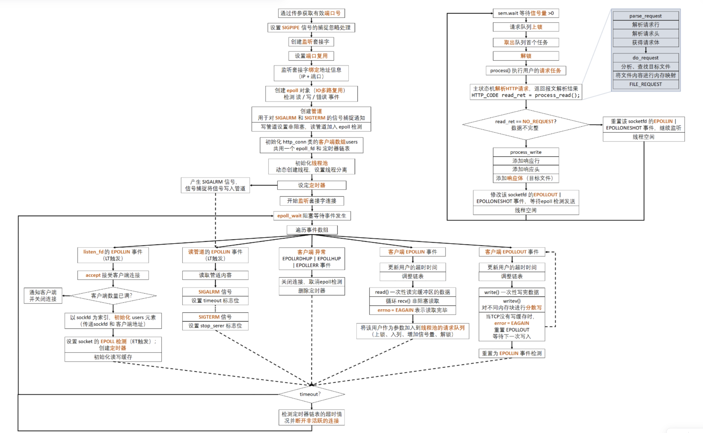
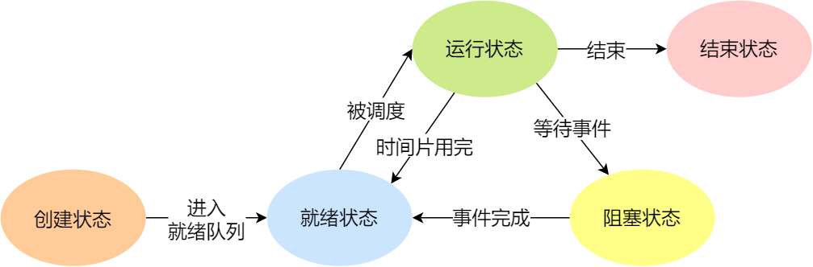
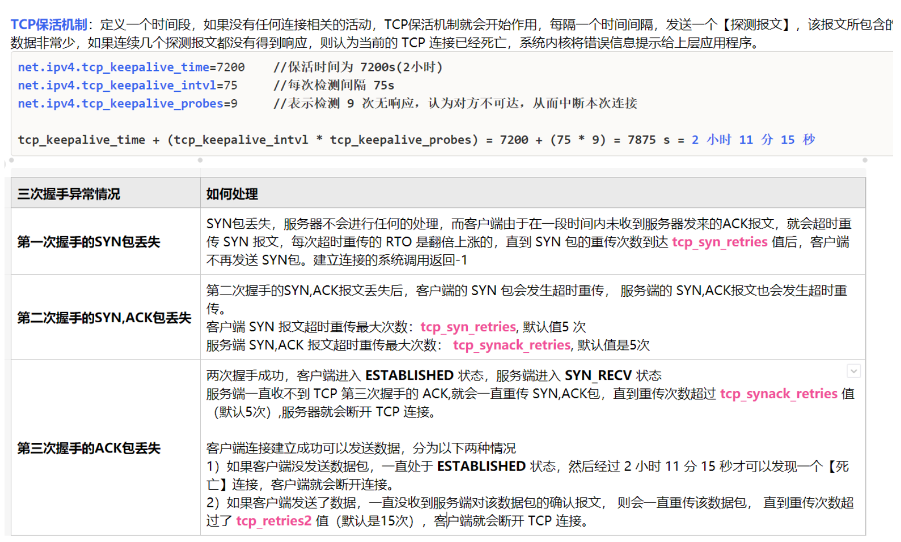

Linux 轻量级高并发 Web 服务器

**项目介绍**

在 Linux 环境下使用 C++ 搭建轻量级高并发 Web 服务器，支持一定数量的客户端连接并及时响应

**内容**

使用**同步 IO 方法 + epoll + 线程池**的方式，模拟 **Proactor** 模式来实现服务器高并发处理
通过使用**有限状态机**，实现对 HTTP 请求的读取和解析，从而实现服务端和客户端之间的通信
利用**双向链表**管理**定时器**及时关闭不活跃的连接
使用 Webbench 对服务器进行**压力测试**，实现一万左右的并发连接


1. 项目如何实现

   

   - 使用**同步 IO 方法 + epoll + 线程池**的方式，模拟 **Proactor** 模式来实现服务器高并发处理

   - 通过使用**有限状态机**，实现对 HTTP 请求的读取和解析，从而实现服务端和客户端之间的通信

   - 利用**双向链表**管理**定时器**及时关闭不活跃的连接

   - 使用 Webbench 对服务器进行**压力测试**，实现一万左右的并发连接

     

2. `select` 和 `epoll` 的区别，`select` 和 `epoll` 的原理

   ##### **`select` 和 `epoll` 的区别**

   select和epoll都是I/O多路复用的机制,主要区别如下:

   （1）**监视的文件描述符数量**:

   - select默认可以监视**1024**个文件描述符,可以通过修改宏重新编译内核来增大此限制,但效率会下降。
   - epoll没有限制,可以监视数万个文件描述符。

   （2）**IO效率**:

   - select采用**轮询**的方式监视所有FD集合,即使只有一个FD就绪,也需要遍历整个FD集合,效率较低。
   - epoll只需要遍历就绪的FD,不需要遍历全部FD集合,效率较高。

   （3）**内存拷贝**:

   - select需要复制大量FD集合和返回结果的内存拷贝操作,**将文件描述符从用户空间拷贝到内核空间**
   - epoll直接操作一组文件描述符,不需要内存拷贝。

   （4）**实现方法**:

   - select基于**链表**来存储FD。
   - epoll在内核实现了一种**红黑树**结构来存放FD。

   （5）**API的使用**:

   - select标准化使用简单,但需要重复定义和构造FD集合。
   - epoll使用相对复杂,但是可以重复使用同一个epoll实例。

   （6）**阻塞/非阻塞**:

   - select调用时会**阻塞**。
   - epoll支持**阻塞和非阻塞**两种模式。

   总结: **epoll方式在时间复杂度和程序优化方面总体上优于select,但是epoll是Linux独有的，select更加可移植,标准化接口编程相对简单。**

   

   

   #### 原理

   #####  理解select函数并实现服务端

   > 在 C++ 中，`select` 函数是用于实现基于 I/O 多路复用的函数，主要用于同时监听多个套接字是否有数据可读、是否可以进行写入等操作。其主要功能如下：
   >
   > 1. 监听套接字的**可读**状态：`select` 函数可以对多个套接字描述符进行监听，当某个套接字有数据可读时，`select` 函数将返回该套接字的描述符，从而实现对多个套接字的同时监听。
   > 2. 监听套接字的**可写**状态：`select` 函数还可以对多个套接字描述符进行监听，当某个套接字可以进行写入时，`select` 函数将返回该套接字的描述符，从而实现对多个套接字的同时监听。
   > 3. 监听套接字的**异常**状态：`select` 函数还可以对多个套接字描述符进行监听，当某个套接字发生异常情况时，例如连接被重置或者接收到非法数据等情况，`select` 函数将返回该套接字的描述符，从而实现对多个套接字的同时监听。
   > 4. 设置超时时间：`select` 函数还可以设置超时时间，当超时时间到达时，`select` 函数将立即返回，避免长时间的阻塞。
   >
   > 通过 `select` 函数，我们可以对多个套接字进行监听，并在有数据到来时及时进行处理，从而提高程序的效率。它是实现基于 I/O 多路复用的重要函数之一。

   使用select函数时可以将多个文件描述符集中到一起统一监视，项目如下：

   - 是否存在套接字接收数据
   - 无需阻塞传输数据的套接字有哪些
   - 哪些套接字发生了异常

   select 函数的使用方法与一般函数的区别并不大，更准确的说，它很难使用。但是为了实现 I/O 复用服务器端，我们应该掌握 select 函数，并运用于套接字编程当中。认为「select 函数是 I/O 复用的全部内容」也并不为过。select 函数的调用过程如下图所示：

   

   **利用 select 函数可以同时监视多个文件描述符，并在有数据到来时及时进行处理，从而提高程序的效率。**当然，监视文件描述符可以视为监视套接字。此时首先需要将要监视的文件描述符集中在一起。集中时也要按照监视项（接收、传输、异常）进行区分，即按照上述 3 种监视项分成 3 类。

   利用 `fd_set` 数组变量执行此操作，如图所示，该数组是存有0和1的位数组。

   

   图中最左端的位表示文件描述符 0（所在位置）。如果该位设置为 1，则表示该文件描述符是监视对象。那么图中哪些文件描述符是监视对象呢？很明显，是描述符 1 和 3。**在 `fd_set` 变量中注册或更改值的操作都由下列宏完成：**

   - `FD_ZERO(fd_set *fdset)`：将 `fd_set` 变量所指的位全部初始化成0
   - `FD_SET(int fd,fd_set *fdset)`：在参数` fdset` 指向的变量中**注册**文件描述符 `fd` 的信息
   - `FD_CLR(int fd,fd_set *fdset)`：从参数 `fdset` 指向的变量中**清除**文件描述符 `fd` 的信息
   - `FD_ISSET(int fd,fd_set *fdset)`：若参数 `fdset` 指向的变量中**包含**文件描述符 `fd`的信息，则返回「真」

   上述函数中，FD_ISSET 用于验证 select 函数的调用结果，通过下图解释这些函数的功能：

   

   

   **设置检查（监视）范围及超时**

   下面是 select 函数的定义：

   ```c++
   #include <sys/select.h>
   #include <sys/time.h>
   
   int select(int maxfd, fd_set *readset, fd_set *writeset,
              fd_set *exceptset, const struct timeval *timeout);
   /*
   成功时返回大于 0 的值，失败时返回 -1
   maxfd: 监视对象文件描述符数量
   readset: 将所有关注「是否存在待读取数据」的文件描述符注册到 fd_set 型变量，并传递其地址值。
   writeset: 将所有关注「是否可传输无阻塞数据」的文件描述符注册到 fd_set 型变量，并传递其地址值。
   exceptset: 将所有关注「是否发生异常」的文件描述符注册到 fd_set 型变量，并传递其地址值。
   timeout: 调用 select 函数后，为防止陷入无限阻塞的状态，传递超时(time-out)信息
   返回值: 发生错误时返回 -1,超时时返回0,。因发生关注的时间返回时，返回大于0的值，该值是发生事件的文件描述符数。
   */
   ```

   如上所述，select 函数用来验证 3 种监视的变化情况，根据监视项声明 3 个 fd_set 型变量，分别向其注册文件描述符信息，并把变量的地址值传递到上述函数的第二到第四个参数。但在此之前（调用 select 函数之前）需要决定下面两件事：

   1. 文件描述符的监视（检查）范围是？
   2. 如何设定 select 函数的超时时间？

   **第一，文件描述符的监视范围和 select 的第一个参数有关**。实际上，select 函数要求通过第一个参数传递监视对象文件描述符的数量。因此，需要得到注册在 `fd_set` 变量中的文件描述符数。但每次新建文件描述符时，其值就会增加 1 ，故只需将最大的文件描述符值加 1 再传递给 select 函数即可。加 1 是因为文件描述符的值是从 0 开始的。

   **第二，select 函数的超时时间与 select 函数的最后一个参数有关**，其中 `timeval` 结构体定义如下：

   ```
   struct timeval
   {
       long tv_sec;
       long tv_usec;
   };
   ```

   本来 select 函数只有在监视文件描述符发生变化时才返回。如果未发生变化，就会进入**阻塞**状态。指定超时时间就是为了防止这种情况的发生。通过上述结构体变量，将秒数填入 `tv_sec` 的成员，将微秒数填入 `tv_usec` 的成员，然后将结构体的地址值传递到 select 函数的最后一个参数。此时，即使文件描述符未发生变化，只要过了指定时间，也可以从函数中返回。不过这种情况下， select 函数返回 0 。因此，可以通过返回值了解原因。如果不想设置超时，则传递 **NULL** 参数。

   

   **调用 select 函数查看结果**

   select 返回正整数时，怎样获知哪些文件描述符发生了变化？向 select 函数的第二到第四个参数传递的 `fd_set` 变量中将产生如图所示的变化：

   

   由图可知，select 函数调用完成后，向其传递的 `fd_set` 变量将发生变化。原来为 1 的所有位将变成 0，但是发生了变化的文件描述符除外。因此，可以认为**值仍为 1 的位置上的文件描述符发生了变化**。

   

   **select函数调用示例**

   ```c++
   #include <iostream>
   #include <unistd.h>
   #include <sys/time.h>
   #include <sys/select.h>
   using namespace std;
   
   #define BUF_SIZE 30
   
   int main(){
       fd_set reads, temp;
       char buf[BUF_SIZE];
       struct timeval timeout;
   
       FD_ZERO(&reads);    //1、设置文件描述符
       FD_SET(0, &reads);  //将输入设备的文件描述符加入到集合reads中
   
       while (1){         
           temp = reads;
           timeout.tv_sec = 5;     //设置超时
           timeout.tv_usec = 0;
   
           int result = select(1, &temp, 0, 0, &timeout);  //调用select函数
           if (result == -1){
               cout << "select() error" << endl;
               break;
           }else if (result == 0){
               cout << "Time out" << endl;
           }else{
               if (FD_ISSET(0, &temp)){
                   int str_len = read(0, buf, BUF_SIZE);
                   buf[str_len] = 0;
                   cout << "Message from console : " << buf << endl;
               }
           }
       }
   
       return 0;
   }
   ```

   调用select之后，结构体`timeva`l的成员`tv_sec`和`tv_usev`的值将被替换为超时剩余时间

    

   

   #####  epoll 理解及应用

   select 复用方法由来已久，因此，利用该技术后，无论如何优化程序性能也无法同时介入上百个客户端。这种 select 方式并不适合以 web 服务器端开发为主流的现代开发环境，所以需要学习 Linux 环境下的 epoll

   

   **基于 select 的 I/O 复用技术速度慢的原因**

   > select函数是一种I/O多路复用技术，用于同时监视多个文件描述符的状态。尽管select函数可以用于同时监视多个文件描述符，但它在实际应用中可能会受到一些限制，导致它的性能相对较慢。以下是一些可能导致select函数性能较慢的原因❤：
   >
   > 1. **每次调用select都需要将监视列表从用户空间拷贝到内核空间，这个过程可能会带来较大的开销。对于大量文件描述符的情况下，这种开销会显得尤为明显。**
   > 2. **select函数只能同时监视一定数量的文件描述符，这个数量通常被限制在1024个左右。如果需要监视更多的文件描述符，则需要通过多次调用select函数来完成，这会导致额外的开销**。
   > 3. **select函数返回时需要遍历整个监视列表，以确定哪些文件描述符发生了事件。如果监视列表非常大，这个过程会非常耗时，从而影响整个系统的性能。**
   > 4. **select函数支持的事件类型有限，只能监视读、写和异常事件，而不能监视其他类型的事件，如定时器事件等。如果需要监视其他类型的事件，就需要使用其他技术，如epoll或kqueue。**
   >
   > 总的来说，虽然select函数是一种比较常见的I/O多路复用技术，但它在某些场景下可能会受到一些限制，导致其性能相对较慢。因此，在实际应用中，需要根据具体情况选择最适合的I/O多路复用技术。

   基于 select 的 I/O 复用技术服务端，其中有不合理的设计如下：

   - 调用 select 函数后常见的针对所有文件描述符的循环语句

     ```c++
     for (int i = 0; i <= fd_max; i++)	//54 lines
         if (FD_ISSET(i, &temp))		    //56 lines
     ```

   - 每次调用 select 函数时都需要向该函数传递监视对象信息

     ```c++
     select(maxfd, &temps, NULL, NULL, timeout);	//将监视列表从用户空间拷贝的操作系统的内核空间
     ```

   上述两点可以从 [echo_selectserv.cpp] 得到确认，调用 select 函数后，并**不是把发生变化的文件描述符单独集中在一起，而是通过作为监视对象的 `fd_set` 变量的变化，找出发生变化的文件描述符（54,56行），因此无法避免针对所有监视对象的循环语句**。而且，作为监视对象的 `fd_set` 会发生变化，所以调用 select 函数前应该复制并保存原有信息，并在每次调用 select 函数时传递新的监视对象信息。

   **select 性能上最大的弱点是：每次传递监视对象信息**，准确的说，select 是监视套接字变化的函数。而套接字是操作系统管理的，所以 select 函数要借助操作系统才能完成功能。select 函数的这一缺点可以通过如下方式弥补：

   > 仅向操作系统传递一次监视对象，监视范围或内容发生变化时只通知发生变化的事项

   这样就无需每次调用 select 函数时都向操作系统传递监视对象信息，但是前提操作系统支持这种处理方式。Linux 的支持方式是 epoll ，Windows 的支持方式是 IOCP。

   

   **select 也有优点**

   select 的兼容性比较高，这样就可以支持很多的操作系统，不受平台的限制，满足以下两个条件使可以使用 select 函数：

   - 服务器端接入者少
   - 程序应该具有兼容性

   

   **实现 epoll 时必要的函数和结构体**

   能够克服 select 函数缺点的 epoll 函数具有以下优点，这些优点正好与之前的 select 函数缺点相反。

   - **无需编写以监视状态变化为目的的针对所有文件描述符的循环语句**
   - **调用对应于 select 函数的 epoll_wait 函数时无需每次传递监视对象信息。**

   下面是 epoll 函数的功能：

   - **epoll_create：创建保存 epoll 文件描述符的空间**							`fd_set reads;`
   - **epoll_ctl：用于添加、修改或删除需要监听的文件描述符**             		    	   `FD_SET、FD_CLR`
   - **epoll_wait：与 select 函数类似，等待文件描述符发生变化**       		     	    `select`

   select 函数中为了保存监视对象的文件描述符，直接声明了 fd_set 变量，但 epoll 方式下的操作系统负责保存监视对象文件描述符，因此需要向操作系统请求创建保存文件描述符的空间，此时用的函数就是 epoll_create 。

   此外，为了添加和删除监视对象文件描述符，select 方式中需要 FD_SET、FD_CLR 函数。但在 epoll 方式中，通过 epoll_ctl 函数请求操作系统完成。最后，select 方式下调用 select 函数等待文件描述符的变化，而 epoll 调用 epoll_wait 函数。还有，select 方式中通过 fd_set 变量查看监视对象的状态变化，而 epoll 方式通过如下结构体 epoll_event 将发生变化的文件描述符单独集中在一起。

   ```c++
   struct epoll_event
   {
       __uint32_t events;		// Epoll events
       epoll_data_t data;		// User data variable
   };
   
   typedef union epoll_data {
       void *ptr;
       int fd;
       __uint32_t u32;
       __uint64_t u64;
   } epoll_data_t;
   ```

   **声明足够大的 `epoll_event` 结构体数组后，传递给 `epoll_wait` 函数时，发生变化的文件描述符信息将被填入数组。因此，无需像 select 函数那样针对所有文件描述符进行循环。**

   

    **epoll_create**

   epoll 是从 Linux 的 2.5.44 版内核开始引入的。通过以下命令可以查看 Linux 内核版本：

   ```c++
   cat /proc/sys/kernel/osrelease
   ```

   下面是 epoll_create 函数的原型：

   ```c++
   #include <sys/epoll.h>
   int epoll_create(int size);
   /*
   成功时返回 epoll 的文件描述符，失败时返回 -1
   size：epoll 实例的大小
   */
   ```

   调用 epoll_create 函数时创建的文件描述符保存空间称为「**epoll 例程**」，但有些情况下名称不同，需要稍加注意。通过参数 size 传递的值决定 epoll 例程的大小，但该值只是向操作系统提出的建议。换言之，size 并不用来决定 epoll 的大小，而仅供操作系统参考。**该函数会创建一个 `epoll` 实例，返回一个整数值作为该实例的文件描述符，可以用于后续的事件监听和控制。**

   > Linux 2.6.8 之后的内核将完全忽略传入 epoll_create 函数的 size 函数，因此内核会根据情况调整 epoll 例程大小。但是本书程序并没有忽略 size

   epoll_create 函数创建的资源与套接字相同，也由操作系统管理。因此，该函数和创建套接字的情况相同，也会返回文件描述符，也就是说返回的文件描述符主要用于区分 epoll 例程。需要终止时，与其他文件描述符相同，也要调用 close 函数

   

   **epoll_ctl**

   **生成例程后，应在其内部注册监视对象文件描述符，此时使用 epoll_ctl 函数**。类似于FD_SET、FD_CLR

   ```c++
   #include <sys/epoll.h>
   int epoll_ctl(int epfd, int op, int fd, struct epoll_event *event);
   /*
   成功时返回 0 ，失败时返回 -1
   epfd：用于注册监视对象的 epoll 例程的文件描述符
   op：用于指定监视对象的添加、删除或更改等操作
   fd：需要注册的监视对象文件描述符
   event：监视对象的事件类型
   */
   ```

   与其他 epoll 函数相比，该函数看起来有些复杂，但通过调用语句就很容易理解，假设按照如下形式调用 epoll_ctl 函数：

   ```c++
   epoll_ctl(A, EPOLL_CTL_ADD, B, C);
   ```

   第二个参数 EPOLL_CTL_ADD 意味着「添加」，上述语句有如下意义：

   > epoll 例程 A 中注册文件描述符 B ，主要目的是为了监视参数 C 中的事件

   再介绍一个调用语句：

   ```c++
   epoll_ctl(A, EPOLL_CTL_DEL, B, NULL);
   ```

   上述语句中第二个参数意味着「删除」，有以下含义：

   > 从 epoll 例程 A 中删除文件描述符 B

   从上述示例中可以看出，从监视对象中删除时，不需要监视类型，因此向第四个参数可以传递为 NULL

   下面是第二个参数的含义：

   - **EPOLL_CTL_ADD：将文件描述符注册到 epoll 例程**
   - **EPOLL_CTL_DEL：从 epoll 例程中删除文件描述符**
   - **EPOLL_CTL_MOD：更改注册的文件描述符的关注事件发生情况**

   epoll_event 结构体用于保存事件的文件描述符结合。但也可以在 epoll 例程中注册文件描述符时，用于注册关注的事件。该函数中 epoll_event 结构体的定义并不显眼，因此通过调用语句说明该结构体在 epoll_ctl 函数中的应用。

   ```c++
   struct epoll_event event;
   ...
   event.events = EPOLLIN;		//发生需要读取数据的情况时
   event.data.fd = sockfd;
   epoll_ctl(epfd, EPOLL_CTL_ADD, sockfd, &event);
   ...
   ```

   上述代码将 epfd 注册到 epoll 例程 epfd 中，并在需要读取数据的情况下产生相应事件。接下来给出 epoll_event 的成员 events 中可以保存的常量及所指的事件类型。

   - **EPOLLIN：需要读取数据的情况**
   - EPOLLOUT：输出缓冲为空，可以立即发送数据的情况
   - EPOLLPRI：收到 OOB 数据的情况
   - EPOLLRDHUP：断开连接或半关闭的情况，这在边缘触发方式下非常有用
   - EPOLLERR：发生错误的情况
   - **EPOLLET：以边缘触发的方式得到事件通知**
   - EPOLLONESHOT：发生一次事件后，相应文件描述符不再收到事件通知。因此需要向 epoll_ctl 函数的第二个参数传递 EPOLL_CTL_MOD ，再次设置事件。

   可通过位或运算同时传递多个上述参数。

   

   **epoll_wait**

   下面是函数原型：

   ```c++
   #include <sys/epoll.h>
   
   int epoll_wait(int epfd, struct epoll_event *events, int maxevents, int timeout);
   /*
   成功时返回发生事件的文件描述符个数，失败时返回 -1
   epfd : 表示事件发生监视范围的 epoll 例程的文件描述符
   events : 保存发生事件的文件描述符集合的结构体地址值
   maxevents : 第二个参数中可以保存的最大事件数
   timeout : 以 1/1000 秒为单位的等待时间，传递 -1 时，一直等待直到发生事件
   */
   ```

   该函数调用方式如下。需要注意的是，第二个参数所指缓冲需要动态分配。

   ```c++
   int event_cnt;
   struct epoll_event *ep_events;
   ...
   ep_events = malloc(sizeof(struct epoll_event)*EPOLL_SIZE);	//EPOLL_SIZE是宏常量
   ...
   event_cnt = epoll_wait(epfd, ep_events, EPOLL_SIZE, -1);
   ...
   ```

   调用函数后，返回发生事件的文件描述符个数，同时在第二个参数指向的缓冲中保存发生事件的文件描述符集合。因此，无需像 `select` 一样插入针对所有文件描述符的循环。

   

   **基于epoll的回声服务端**

   服务端echo_epollserv代码：

   ```c++
   // 实现基于epoll的多路复用
       int epfd = epoll_create(EPOLL_SIZE);		// 使用epoll_create()函数创建了一个epoll实例，并将返回的文件描述符赋值给整型变量epfd
       struct epoll_event *ep_events = new epoll_event[EPOLL_SIZE];    // 等价于ep_events = malloc(sizeof(struct epoll_event) * EPOLL_SIZE)，在这里使用的是C++中的写法  	保存发生事件的文件描述符集合的结构体地址
   
       struct epoll_event event; 	  // 监视对象的事件类型
       event.events = EPOLLIN;       // 监听可读事件。这意味着当指定的文件描述符有可读数据时，内核会通知程序处理。
       event.data.fd = serv_sock;    // 将serv_sock的文件描述符与事件相关联。当监听到serv_sock上的EPOLLIN事件时，内核将通知程序处理serv_sock上的数据
   
       epoll_ctl(epfd, EPOLL_CTL_ADD, serv_sock, &event);
       // epoll例程epfd中注册文件描述符serv_sock，主要目的是监视参数event中的事件
   
       while (1){
           int event_cnt = epoll_wait(epfd, ep_events, EPOLL_SIZE, -1);
   
           if (event_cnt == -1){
               cout << "epoll_wait error" << endl;
               break;
           }
   
           for (int i = 0 ; i < event_cnt; i++){
               // 第i个发生事件的文件描述符ep_event[i].data.fd
               if (ep_events[i].data.fd == serv_sock){     
                   clnt_size = sizeof(clnt_sock);
                   clnt_sock = accept(serv_sock, (struct sockaddr*)&clnt_addr, &clnt_size);
                   if (clnt_sock == -1){
                       cout << "server accept error" << endl;
                       break;
                   }
                   event.events = EPOLLIN;		// 将客户端的读事件也加入到epoll中进行监听
                   event.data.fd = clnt_sock;
                   epoll_ctl(epfd, EPOLL_CTL_ADD, clnt_sock, &event); // 将clnt_sock上发生的读事件加入监听
                   cout << "connect client : " << clnt_sock << endl;
               }else{
                   int str_len = read(ep_events[i].data.fd, buf, BUF_SIZE);
                   if (str_len == 0){
                       epoll_ctl(epfd, EPOLL_CTL_DEL, ep_events[i].data.fd, NULL);	//从例程epfd中删除文件描述符
                       close(ep_events[i].data.fd);
                       cout << "closed client : " << ep_events[i].data.fd << endl;
                   }else   
                       write(ep_events[i].data.fd, buf, str_len);
               }
           }
       }
   ```

   

   

   

3. 同步和异步的区别，Linux下的IO模型

   [阻塞非阻塞与同步异步](https://www.zhihu.com/question/19732473)

   

   #### 数据就绪

   根据系统IO操作的就绪状态

   - **阻塞（Blocking）IO**： 阻塞IO是指当应用程序发起一个IO操作（如读取文件或从网络接收数据）时，程序会一直等待，直到操作完成为止。在阻塞IO模型中，应用程序的执行流程会被阻塞，直到IO操作完成并返回所需的数据或状态。这意味着程序在IO操作执行期间无法做其他工作。

   - **非阻塞（Non-blocking）IO**： 非阻塞IO是指当应用程序发起一个IO操作后，程序会立即返回而不等待操作完成。即使IO操作尚未完成，应用程序也可以继续执行其他任务。然后，应用程序可以周期性地检查IO操作是否已经完成，如果完成了，就可以获取所需的数据。这种模型允许程序在等待IO操作完成时仍然保持响应能力，可以同时处理多个IO操作。

     需要注意的是，非阻塞IO不是让CPU空转等待IO操作完成，而是通过**轮询（polling）或回调（callback）机制**来实现。在轮询中，应用程序会定期查询IO操作是否已完成，而在回调中，应用程序提供一个回调函数，当IO操作完成时，操作系统或IO系统会调用该函数。

      

       

   [5种IO模型](https://segmentfault.com/a/1190000039898780)

   

   "IO模型"通常指的是计算机程序中用于处理输入和输出（IO）操作的不同方法和策略。在计算机系统中，IO操作涉及将数据从程序和外部设备（例如磁盘、网络、键盘等）之间传输。不同的IO模型会影响程序的性能、可扩展性和资源利用率。

   ###### (1) 阻塞IO模型（Blocking IO）

   在这个模型中，当一个IO操作发生时，程序会被阻塞（暂停执行），直到IO操作完成。这意味着程序不能继续执行其他任务，直到IO操作完成。这种模型通常简单易用，但是在高并发情况下可能导致资源浪费，因为线程可能会长时间地等待IO操作。

   

   

   ###### (2) 非阻塞IO模型（Non-blocking IO）

   在非阻塞IO模型中，当一个IO操作被调用时，它会立即返回，而不会阻塞程序的执行。程序可以继续执行其他任务，但需要定期**轮询**IO操作的状态，以确定它是否完成。这种模型减少了阻塞等待时间，但需要额外的轮询操作。

   

   

   ###### (3) 多路复用IO模型（Multiplexing IO）

   这个模型使用像  `select`、`poll`、`epoll`（在Linux上）或 `kqueue`（在BSD上）等机制，允许程序监视多个IO操作的状态。程序可以阻塞地等待多个IO操作中的任何一个准备就绪，然后处理就绪的操作。这种模型减少了轮询的开销，并且可以处理大量的并发IO。

   

   

   ###### (4) 信号驱动 IO 模型

   信号驱动 IO（Signal Driven IO）：可以为 socket 开启信号驱动 IO 功能，应用进程需向内核注册一个信号处理程序，该操作并立即返回。当内核中有数据准备好，会发送一个信号给应用进程，应用进程便可以在信号处理程序中发起 IO 系统调用，来完成数据读取了。

   

   

   ###### (5) 异步IO模型（Asynchronous IO）

   在异步IO模型中，程序提交一个IO操作，然后可以继续执行其他任务，而不需要等待IO操作完成。当IO操作完成时，系统会通知程序，从而可以处理已完成的操作。这种模型适用于需要处理大量并发IO操作的情况。

   

   

   

   

   **Summary**

   从上述五种 IO 模型可以看出，应用进程对内核发起 IO 系统调用后，内核会经过两个阶段来完成数据的传输：

   - 第一阶段：等待数据。即应用进程发起 IO 系统调用后，会一直等待数据；当有数据传入服务器，会将数据放入内核空间，此时数据准备好。
   - 第二阶段：将数据从内核空间复制到用户空间，并返回给应用程序成功标识。

   

   前四种模型的第二阶段是相同的，都是处于阻塞状态，其主要区别在第一阶段。而异步 IO 模型则不同，应用进程在这两个阶段是完全不阻塞的。

   | IO 模型      | 第一阶段       | 第二阶段 |
   | ------------ | -------------- | -------- |
   | 阻塞式IO     | 阻塞           | 阻塞     |
   | 非阻塞式IO   | 非阻塞         | 阻塞     |
   | IO多路程复用 | 阻塞（select） | 阻塞     |
   | 信号驱动式IO | 异步           | 阻塞     |
   | 异步IO       | 异步           | 异步     |

    

   

4. 为什么使用 `Proactor` 模式不使用  `Reactor` 模式，边缘触发和条件触发的区别

   #####  **两种高效的事件处理模式**

   服务器程序通常需要处理三类事件:I/O 事件、信号及定时事件。

   有两种高效的事件处理模式:Reactor和 Proactor，

   - 同步 I/O 模型通常用于实现 Reactor 模式
   - 异步 I/O 模型通常用于实现 Proactor 模式。

   

   ####  Reactor模式

   要求主线程(I/O处理单元)只负责监听文件描述符上是否有事件发生，有的话就立即将该事件通知工作线程(逻辑单元)，将 socket 可读可写事件放入请求队列，交给工作线程处理。除此之外，主线程不做任何其他实质性的工作。读写数据，接受新的连接，以及处理客户请求均在工作线程中完成。

   使用同步 I/O(以 epoll_wait 为例)实现的 Reactor 模式的工作流程是:

   1. 主线程往 epoll 内核事件表中注册 socket 上的读就绪事件。

   2. 主线程调用 epoll_wait 等待 socket 上有数据可读。

   3. 当 socket 上有数据可读时， epoll_wait 通知主线程。主线程则将 socket 可读事件放入请求队列。

   4. 睡眠在请求队列上的某个工作线程被唤醒，它从 socket 读取数据，并处理客户请求，然后往 epoll 内核事件表中注册该 socket 上的写就绪事件。

   5. 当主线程调用 epoll_wait 等待 socket 可写。

   6. 当 socket 可写时，epoll_wait 通知主线程。主线程将 socket 可写事件放入请求队列。

   7. 睡眠在请求队列上的某个工作线程被唤醒，它往 socket 上写入服务器处理客户请求的结果。

      

   Reactor 模式的工作流程:

   

   

   #### Proactor模式

   Proactor 模式将所有 I/O 操作都交给主线程和内核来处理(进行读、写)，工作线程仅仅负责业务逻辑。使用异步 I/O 模型(以 aio_read 和 aio_write 为例)实现的 Proactor 模式的工作流程是:

   1. 主线程调用 aio_read 函数向内核注册 socket 上的读完成事件，并告诉内核用户读缓冲区的位置， 以及读操作完成时如何通知应用程序(这里以信号为例)。

   2. 主线程继续处理其他逻辑。

   3. 当 socket 上的数据被读入用户缓冲区后，内核将向应用程序发送一个信号，以通知应用程序数据已经可用。

   4. 应用程序预先定义好的信号处理函数选择一个工作线程来处理客户请求。工作线程处理完客户请求后，调用 aio_write 函数向内核注册 socket 上的写完成事件，并告诉内核用户写缓冲区的位置，以及写操作完成时如何通知应用程序。

   5. 主线程继续处理其他逻辑。

   6. 当用户缓冲区的数据被写入 socket 之后，内核将向应用程序发送一个信号，以通知应用程序数据已经发送完毕。

   7. 应用程序预先定义好的信号处理函数选择一个工作线程来做善后处理，比如决定是否关闭 socket。

      

   Proactor 模式的工作流程:

   

   

   #### 模拟Proactor模式 ❤️

   使用同步 I/O 方式模拟出 Proactor 模式。

   原理:**主线程执行数据读写操作，读写完成之后，主线程向工作线程通知这一”完成事件“。那么从工作线程的角度来看，它们就直接获得了数据读写的结果，接下来要做的只是对读写的结果进行逻辑处理。**

   使用同步 I/O 模型(以 epoll_wait为例)模拟出的 Proactor 模式的工作流程如下:

   1. 主线程往 epoll 内核事件表中注册 socket 上的读就绪事件。
   2. 主线程调用 epoll_wait 等待 socket 上有数据可读。
   3. 当 socket 上有数据可读时，epoll_wait 通知主线程。主线程从 socket 循环读取数据，直到没有更多数据可读，然后将读取到的数据封装成一个请求对象并插入请求队列。
   4. 睡眠在请求队列上的某个工作线程被唤醒，它获得请求对象并处理客户请求，然后往 epoll 内核事件表中注册 socket 上的写就绪事件。
   5. 主线程调用 epoll_wait 等待 socket 可写。
   6. 当 socket 可写时，epoll_wait 通知主线程。主线程往 socket 上写入服务器处理客户请求的结果。

   

   同步 I/O 模拟 Proactor 模式的工作流程:

   

   

   

   

   

5. 进程和线程的创建方式，进程和线程之间的区别，进程有哪些状态

   

   ##### 在C++中,创建进程和线程的常用方式有:

   （1）创建进程

   - system() - 使用系统命令创建进程
   - fork() - 创建调用进程的一个副本
   - exec() - 用新进程替换老进程
   - popen() - 创建到Shell命令的管道

   （2）创建线程

   - pthread - POSIX线程,包含pthread.h头文件,使用pthread_create()创建线程

   - std::thread - C++11线程库,包含<thread>头文件,使用std::thread构造函数创建线程

   - boost::thread - Boost线程库,包含boost/thread.hpp头文件,使用boost::thread构造函数创建线程

     

   ##### 线程与进程的比较如下：

   - 进程是资源（包括内存、打开的文件等）分配的单位，线程是 CPU 调度的单位；
   - 进程拥有一个完整的资源平台，而线程只独享必不可少的资源，如寄存器和栈；
   - 线程同样具有**就绪、阻塞、执行**三种基本状态，同样具有状态之间的转换关系；
   - 线程能减少并发执行的时间和空间开销；

   对于，线程相比进程能减少开销，体现在：

   - 线程的创建时间比进程快，因为进程在创建的过程中，还需要资源管理信息，比如内存管理信息、文件管理信息，而线程在创建的过程中，不会涉及这些资源管理信息，而是**共享**它们；
   - 线程的终止时间比进程快，因为线程释放的资源相比进程少很多；
   - 同一个进程内的线程切换比进程切换快，因为线程具有相同的地址空间（虚拟内存共享），这意味着同一个进程的线程都具有同一个页表，那么在切换的时候不需要切换页表。而对于进程之间的切换，切换的时候要把页表给切换掉，而页表的切换过程开销是比较大的；
   - 由于同一进程的各线程间共享内存和文件资源，那么在线程之间数据传递的时候，就不需要经过内核了，这就使得线程之间的数据交互效率更高了；

   所以，不管是时间效率，还是空间效率线程比进程都要高 

   

   **多进程的缺点可概括为**:

   - 创建进程的过程会带来一定的开销，每个进程都需要独立的资源，如独立的内存空间、文件描述符 等，这会增加系统的负担。
   -  为了完成进程间数据交换，需要特殊的 IPC 技术，如**管道、消息队列、共享内存**等，这些机制使用起来相对复杂。

   - 但是更大的缺点是下面的:
      每秒少则 10 次，多则千次的**「上下文切换」**是创建进程的最大开销

   只有一个 CPU 的系统是将时间分成多个微小的块后分配给了多个进程。为了分时使用 CPU ，需要「上下文切换」的过程。「**上下文切换」是指运行程序前需要将相应进程信息读入内存**，如果运行进程 A 后 紧接着需要运行进程 B ，就应该将进程 A 相关信息移出内存，并读入进程 B 相关信息。这就是上下文切 换。但是此时进程 A 的数据将被移动到硬盘，所以上下文切换要很长时间，即使通过优化加快速度，也 会存在一定的局限。

   为了保持多进程的优点，同时在一定程度上克服其缺点，人们引入的线程(Thread)的概念。这是为了 将进程的各种劣势降至最低程度(不是直接消除)而设立的一种「轻量级进程」。

   

   **线程比进程具有如下优点:**

   - **资源消耗更少:**

     线程在进程内部运行，共享进程的资源，如内存、文件描述符等，因此线程 的创建和**上下文切换**的开销比进程要小很多。

   - **执行效率更高:**

     由于线程共享进程的内存空间，因此线程之间的数据共享和通信相对容易实现，这比进程之间的通信要快速、简单。

   - **编程更简单:**

     线程之间的通信和同步相对简单，因为线程共享相同的地址空间，因此数据共享的方式更加简单。

   - **更好的可扩展性:**

     由于线程比进程消耗更少的资源，因此可以创建更多的线程，从而提高程序的并发性和处理能力。

   综上所述，线程比进程具有更好的资源利用效率、执行效率、编程简单性和可扩展性等优点。因此，在多线程和多进程之间进行选择时，需要根据具体的应用场景和需求进行权衡。

   

   **线程和进程的差异**

   线程和进程是操作系统中最基本的概念，它们之间的区别主要有以下几个方面:

   1. **资源占用:**

      进程是资源分配的基本单位，一个进程拥有独立的地址空间、文件描述符、信号 处理器等资源。而线程是进程的执行实体，它和同一进程内的其他线程共享进程的所有资 源。**

   2. **调度和切换**:

      **进程是系统资源的拥有者，它需要操作系统进行调度和切换**，进程的切换需要保存和恢复进程的所有状态信息，包括进程的PC值、寄存器状态、内存映像等。**而线程是在进程内部进行调度和切换**，线程的切换相对于进程的切换来说更加快速。

   3. **通信和同步:**

      由于线程共享进程的地址空间，因此**线程之间通信和同步相对简单，如可以使用共享内存、信号量、互斥量等机制来实现。而进程之间的通信和同步则需要使用操作系统提供的IPC机制**。

   4. **安全性:**

      由于线程共享进程的地址空间，因此线程之间的安全问题更加复杂。**当一个线程写入数据时，需要考虑其他线程是否正在读取或写入同一数据，从而避免数据的竞争和冲突。 而进程之间由于地址空间是独立的，因此安全性相对较高**。

   5. **创建和销毁:**

      **创建和销毁线程的开销比进程小很多，因为线程的创建和销毁只需要操作系统分配和释放栈空间即可，而进程的创建和销毁则需要进行更多的初始化和清理工作。**

   

   ##### 进程的状态

   在上面，我们知道了进程有着「运行 - 暂停 - 运行」的活动规律。一般说来，一个进程并不是自始至终连续不停地运行的，它与并发执行中的其他进程的执行是相互制约的。

   它有时处于运行状态，有时又由于某种原因而暂停运行处于等待状态，当使它暂停的原因消失后，它又进入准备运行状态。

   所以，**在一个进程的活动期间至少具备三种基本状态，即运行状态、就绪状态、阻塞状态。**

   

   上图中各个状态的意义：

   - 运行状态（*Running*）：该时刻进程占用 CPU；
   - 就绪状态（*Ready*）：可运行，由于其他进程处于运行状态而暂时停止运行；
   - 阻塞状态（*Blocked*）：该进程正在等待某一事件发生（如等待输入/输出操作的完成）而暂时停止运行，这时，即使给它CPU控制权，它也无法运行；

   当然，进程还有另外两个基本状态：

   - 创建状态（*new*）：进程正在被创建时的状态；
   - 结束状态（*Exit*）：进程正在从系统中消失时的状态；

   于是，一个完整的进程状态的变迁如下图：

   

   再来详细说明一下进程的状态变迁：

   - *NULL -> 创建状态*：一个新进程被创建时的第一个状态；
   - *创建状态 -> 就绪状态*：当进程被创建完成并初始化后，一切就绪准备运行时，变为就绪状态，这个过程是很快的；
   - *就绪态 -> 运行状态*：处于就绪状态的进程被操作系统的**进程调度器选中**后，就分配给 CPU 正式运行该进程；
   - *运行状态 -> 结束状态*：当进程已经运行完成或出错时，会被操作系统作结束状态处理；
   - *运行状态 -> 就绪状态*：处于运行状态的进程在运行过程中，由于分配给它的**运行时间片用完**，操作系统会把该进程变为就绪态，接着从就绪态选中另外一个进程运行；
   - *运行状态 -> 阻塞状态*：当进程**请求某个事件且必须等待时**，例如请求 I/O 事件；
   - *阻塞状态 -> 就绪状态*：**当进程要等待的事件完成时**，它从阻塞状态变到就绪状态；

   

    

   ##### 协程

   协程（Coroutine）是一种计算机程序组件，它是一种可以暂停和恢复执行的计算单元，具有以下特点：

   1. **轻量级**：协程相对于线程来说更轻量，因为它们共享同一个线程的上下文，不需要像线程那样创建额外的操作系统资源。这使得协程的创建和销毁更加高效。

   2. **非抢占式**：协程是协作式多任务处理的一种形式，它们不会被强制性地中断，而是在协程主动让出执行权的时候才会切换到其他协程。这意味着控制权的转移是由开发者明确控制的，而不是由操作系统或调度器强制执行。

   3. **共享状态**：协程通常可以共享相同的内存空间，这使得它们可以更容易地共享数据和状态信息，而无需像多线程编程那样处理复杂的同步问题。

   4. **适用于异步编程**：协程在异步编程中非常有用，可以用于处理高并发的I/O操作，例如网络通信或文件读写。通过在I/O操作时挂起当前协程，可以充分利用CPU资源来执行其他协程，而不是等待阻塞的I/O操作完成。

   5. **简化复杂性**：协程可以简化一些复杂的编程任务，例如状态机的实现或处理协作多任务问题，因为它们可以将任务分解为更小的可管理的部分，每个部分都可以用协程来表示。

      C++20中支持了协程

   

6. 为什么不使用进程池，线程池的优点

   本质上就是和进程相比，线程的优点

    

   

7. 进程间通信的方式，多个线程访问临界资源如何解决

   ##### 进程间通信的主要方式有:

   1. **管道(Pipe)**:管道是一种半双工的通信方式,数据只能单向流动。（实现全双工通信，则需要两个双向的管道）
   2. **信号(Signal)**:通过发送信号通知进程某个事件已经发生。
   3. **消息队列(Message Queue)**:消息队列允许进程通过队列来交换数据。
   4. **共享内存(Shared Memory)**:两个进程映射到同一个共享内存空间进行通信。
   5. **套接字(Socket)**:类似管道,但是可以进行双工通信,进程间通信的主要方式。

   ##### 多个线程访问临界资源时,需要使用同步机制来互斥访问,常见的有:

   1. **互斥锁(Mutex)**:提供互斥访问的锁机制。
   2. **信号量(Semaphore)**:用于控制访问共享资源的线程数量。
   3. **事件(Event)**:用于一个线程通知其他线程某事件已发生。
   4. **条件变量(Condition Variable)**:可以使线程等待某条件满足而阻塞。

   其中,互斥锁是最常用的同步机制,可以保证每次只有一个线程可以进入临界区,避免竞争条件。Signal/Wait机制利用条件变量实现等待机制。 

   

8. 什么是僵尸进程


   僵尸进程(Zombie Process)又称为Defunct Process,是指**在进程结束后，其父进程没有及时回收子进程的资源，导致子进程的进程描述符仍然存在于系统中，但子进程已经不再运行，从而成为了“僵尸进程”。**。它具有以下特点:

   - 僵尸进程已经终止,不再占用系统资源如CPU等,但**进程描述符(进程ID)仍然存在**。
   - **僵尸进程无法正常运行**,已经失去作用,但进程描述符存在使其可以查看进程信息。
   - 父进程没有调用**wait**()或**waitpid**()来获取僵尸进程的退出状态信息,导致僵尸进程未被销毁。
   - 父进程退出后,僵尸进程会被**init进程**(进程ID为1)所收养,并最终释放进程资源。
   - 僵尸进程大量存在会**占用进程号**,降低系统整体性能。

   ##### 产生僵尸进程的主要原因:

   - 父进程没有处理子进程退出的情形。
   - 父进程意外退出而没有处理子进程。

   ##### 避免僵尸进程的方法:

   - 父进程调用wait()或waitpid()获取子进程退出信息。
   - 使用信号处理函数在父进程退出前收集子进程。
   - 父进程在fork子进程后立即退出。

   总之,僵尸进程是没有被正确处理的已经终止进程,需要通过合理清理避免其存在

   

9. 有限状态机

   主从状态机的状态定义：

   

   再来复习一下HTTP报文的格式。HTTP报文由请求报文和响应报文两部分组成。

   请求报文包含请求行、请求头部和请求数据。

   

   响应报文包含状态行、响应头部和响应数据。

   我们可以使用有限状态机来解析HTTP报文,主要步骤如下:

   1. 定义状态:请求行状态、请求头状态、请求体状态、行完整、行数据尚且不完整、行出错等

   2. 定义迁移条件:收到回车+换行时状态迁移、遇到空行时状态迁移等

   3. 处理每个状态下的数据:在请求行状态下解析方法、URL、HTTP版本等;在头部状态下解析各个头部字段等

   4. 设定结束状态:解析完成后进入End状态

      

   例如一个简单的切换逻辑:
   请求行状态 - 收到回车换行 -> 进入请求头状态
   请求头状态 - 收到回车换行 -> 如果是空行则进入响应状态,否则继续请求头状态
   请求头 - 收到回车换行和空行 -> 进入请求体
   ...

   通过有限状态机,我们只需要关心每一个状态下应该如何解析,并设定状态的迁移条件,就可以正确解析HTTP报文的格式,逐步提取出我们需要的信息,实现报文解析。

    

   

10. 双向链表的操作，定时器

     [视频链接](https://www.nowcoder.com/study/live/504/5/9)

    

11. `tcp` 连接的建立和释放，`tcp` 和 `udp` 的区别

    [TCP连接管理视频讲解](https://www.bilibili.com/video/BV19E411D78Q?p=64&spm_id_from=pageDriver&vd_source=4c396a7eb4588d54f454e1f3fe6f25bd)

    **TCP连接管理**

    

    **TCP的连接建立**

    

    三次握手是 TCP 连接的建立过程。在握手之前，主动打开连接的客户端结束 CLOSE 阶段，被动打开的服务器也结束 CLOSE 阶段，并进入 LISTEN 阶段。随后进入三次握手阶段：

    ① 首先客户端向服务器发送一个 SYN 包，并等待服务器确认，其中：

    - 标志位为 SYN = 1，表示请求建立连接；
    - 序号为 seq = x（x 一般取随机数）；
    - 随后客户端进入 SYN-SENT 阶段。

    

    ② 服务器接收到客户端发来的 SYN 包后，对该包进行确认后结束 LISTEN 阶段，并返回一段 TCP 报文，其中：

    - 标志位为 SYN = 1 和 ACK = 1，表示确认客户端的报文 seq 序号有效，服务器能正常接收客户端发送的数据，并同意创建新连接；
      序号为 Seq = y 随机；

    - 确认号为 ack = x + 1，表示收到客户端的序号 seq 并将其值加 1 作为自己确认号 ack 的值，随后服务器端进入 SYN-RECV 阶段。

      **其中ack = 收到的seq号 + 传递的字节数 + 1**

    

    ③ 客户端接收到发送的 SYN + ACK 包后，**明确了从客户端到服务器的数据传输是正常的**，从而结束 SYN-SENT 阶段。并返回最后一段报文。其中：

    - 标志位为 ACK = 1，表示确认收到服务器端同意连接的信号；

    - 序号为 seq = x + 1，表示收到服务器端的确认号 ack，并将其值作为自己的序号值；

    - 确认号为 ack= y + 1，表示收到服务器端序号 seq，并将其值加 1 作为自己的确认号 ack 的值。

    - 随后客户端进入 ESTABLISHED。

      

    一旦三次握手完成，TCP连接就建立了。在此之后，双方可以开始通过连接进行数据传输。

    **三次握手过程的目的是为了确保连接建立的可靠性和正确性。第一次握手确保客户端和服务器都能够相互通信，第二次握手确保服务器接收到了客户端的请求，并且可以响应它，第三次握手则确保客户端知道服务器已经接受了它的请求，并且可以开始在连接上进行数据传输。**

    需要注意的是，三次握手的过程可以防止由于网络问题或恶意攻击导致的连接建立失败，但并不能防止所有的攻击，因此在进行TCP连接时，还需要采取其他安全措施来保护连接的安全和稳定。

    

    **TCP的连接释放**

    

    四次挥手即 TCP 连接的释放，这里假设客户端主动释放连接。在挥手之前主动释放连接的客户端结束 ESTABLISHED 阶段，随后开始四次挥手：

    ① 首先客户端向服务器发送一段 TCP 报文表明其想要释放 TCP 连接，其中：

    - 标记位为 FIN = 1，表示请求释放连接；
    - 序号为 seq = u；
    - 随后客户端进入 FIN-WAIT-1 阶段，即**半关闭阶段**，并且停止向服务端发送通信数据。

    

    ② 服务器接收到客户端请求断开连接的 FIN 报文后，结束 ESTABLISHED 阶段，进入 CLOSE-WAIT 阶段并返回一段 TCP 报文，其中：

    - 标记位为 ACK = 1，表示接收到客户端释放连接的请求；

    - 序号为 seq = v；

    - 确认号为 ack = u + 1，表示是在收到客户端报文的基础上，将其序号值加 1 作为本段报文确认号 ack 的值；

    - 随后服务器开始准备释放服务器端到客户端方向上的连接。

    - 客户端收到服务器发送过来的 TCP 报文后，确认服务器已经收到了客户端连接释放的请求，随后客户端结束 FIN-WAIT-1 阶段，进入 FIN-WAIT-2 阶段。

      

    ③ 服务器端在发出 ACK 确认报文后，服务器端会将遗留的待传数据传送给客户端，待传输完成后即经过 CLOSE-WAIT 阶段，便做好了释放服务器端到客户端的连接准备，再次向客户端发出一段 TCP 报文，其中：

    - 标记位为 FIN  = 1和 ACK = 1，表示已经准备好释放连接了；
    - 序号为 seq = w；
    - 确认号 ack = u + 1，表示是在收到客户端报文的基础上，将其序号 seq 的值加 1 作为本段报文确认号 ack 的值。
    - 随后服务器端结束 CLOSE-WAIT 阶段，进入 LAST-ACK 阶段。并且停止向客户端发送数据。

    

    ④ 客户端收到从服务器发来的 TCP 报文，确认了服务器已经做好释放连接的准备，于是结束 FIN-WAIT-2 阶段，进入 TIME-WAIT 阶段，并向服务器发送一段报文，其中：

    - 标记位为 ACK = 1，表示接收到服务器准备好释放连接的信号；
    - 序号为 seq= u + 1，表示是在已收到服务器报文的基础上，将其确认号 ack 值作为本段序号的值；
    - 确认号为 ack= w + 1，表示是在收到了服务器报文的基础上，将其序号 seq 的值作为本段报文确认号的值。

    随后客户端开始在 TIME-WAIT 阶段等待 2 MSL。服务器端收到从客户端发出的 TCP 报文之后结束 LAST-ACK 阶段，进入 CLOSED 阶段。由此正式确认关闭服务器端到客户端方向上的连接。客户端等待完 2 MSL 之后，结束 TIME-WAIT 阶段，进入 CLOSED 阶段，由此完成「四次挥手」。

    

    **如果三次握手的时候每次握手信息对方没有收到会怎么样**

    - 若第一次握手服务器未接收到客户端请求建立连接的数据包时，**服务器不会进行任何相应的动作**，而客户端由于在一段时间内没有收到服务器发来的确认报文， 因此会等待一段时间后重新发送 SYN 同步报文，若仍然没有回应，则重复上述过程直到发送次数超过最大重传次数限制后，建立连接的系统调用会返回 -1。
    - 若第二次握手客户端未接收到服务器回应的 ACK 报文时，客户端会采取第一次握手失败时的动作，这里不再重复，而**服务器端此时将阻塞在 accept() 系统调用处等待 client 再次发送 ACK 报文**。
    - 若第三次握手服务器未接收到客户端发送过来的 ACK 报文，同样会采取类似于客户端的**超时重传机制**，若重传次数超过限制后仍然没有回应，则 accept() 系统调用返回 -1，**服务器端连接建立失败**。但此时客户端认为自己已经连接成功了，因此开始向服务器端发送数据，但是服务器端的 accept() 系统调用已返回，此时没有在监听状态。因此服务器端接收到来自客户端发送来的数据时会发送RST 报文给客户端，消除客户端单方面建立连接的状态。

    

    

    **为什么要进行三次握手？两次握手可以吗？**

    三次握手的主要目的是确认自己和对方的发送和接收都是正常的，从而保证了双方能够进行可靠通信。**若采用两次握手，当第二次握手后就建立连接的话，此时客户端知道服务器能够正常接收到自己发送的数据，而服务器并不知道客户端是否能够收到自己发送的数据。**

    我们知道网络往往是非理想状态的（存在丢包和延迟），当客户端发起创建连接的请求时，如果服务器直接创建了这个连接并返回包含 SYN、ACK 和 Seq 等内容的数据包给客户端，这个数据包因为网络传输的原因丢失了，丢失之后客户端就一直接收不到返回的数据包。由于客户端可能设置了一个超时时间，一段时间后就关闭了连接建立的请求，再重新发起新的请求，而服务器端是不知道的，如果没有第三次握手告诉服务器客户端能否收到服务器传输的数据的话，服务器端的端口就会一直开着，等到客户端因超时重新发出请求时，服务器就会重新开启一个端口连接。长此以往， 这样的端口越来越多，就会造成服务器开销的浪费。

    

    **第 2 次握手传回了 ACK，为什么还要传回 SYN**

    SYN是服务端请求连接

    

    **为什么要四次挥手？**

    释放 TCP 连接时之所以需要四次挥手，是因为FIN释放连接报文和ACK确认接收报文是分别在两次握手中传输的。 当主动方在数据传送结束后发出连接释放的通知，由于被动方可能还有必要的数据要处理，所以会先返回 ACK 确认收到报文。当被动方也没有数据再发送的时候，则发出连接释放通知，对方确认后才完全关闭TCP连接。

    举个例子：A 和 B 打电话，通话即将结束后，A 说“我没啥要说的了”，B回答“我知道了”，但是 B 可能还会有要说的话，A 不能要求 B 跟着自己的节奏结束通话，于是 B 可能又巴拉巴拉说了一通，最后 B 说“我说完了”，A 回答“知道了”，这样通话才算结束。

    **简单来说就是因为TCP是全双工的，两个方向的连接需要单独关闭。**

    

    **TCP 和 UDP 的区别**

    | 类型 | **是否面向连接** | **传输可靠性** | 传输形式   | **传输效率** | **所需资源** | **应用场景**       | **首部字节** |
    | ---- | ---------------- | -------------- | ---------- | ------------ | ------------ | ------------------ | ------------ |
    | TCP  | 是               | 可靠           | 字节流     | 低           | 多           | 文件、邮件传输     | 20-60        |
    | UDP  | 否               | 不可靠         | 数据报文段 | 高           | 少           | 即时通讯、域名转化 | 8个字节      |

    

      

    

12. `http` 和 `https`的区别，在浏览器中输入网址建立连接的过程

     http和https

    面试难度：🌟🌟🌟🌟🌟 面试考核频率：🌟🌟🌟🌟🌟

    

    **http 使用过程中存在安全性问题**

    使用明文通信，内容可能会被窃听
    不验证通信方的身份，通信方的身份有可能遭遇伪装
    无法证明报文的完整性，报文有可能遭篡改
    所以引入了 https，通过 ssl(Secure Sockets Layer)/tls(Transport Layer Security) 的方式使 http 变成了安全的 https

    http 数据发送时 request 直接通过 tcp 发送；数据接收时，tcp 接收的数据作为 response
    httpsv数据发送时 request 通过 ssl/tls 进行处理，然后再通过 tcp 进行发送；数据接收时，同样也是要通过 ssl/tls 进行处理。相当于在应用层 http 和传输层 tcp 之间多加了一步处理

    

    注意：http3.0 传输协议已经从 tcp切换为 udp

    

    **https 如何处理这些安全问题**
    数据加密
    数字证书认证
    通过 ssl/tls 报文摘要功能检验报文完整性

    

    **数据加密：**
    加密方式有两种：对称加密和非对称加密

    对称加密：加密和解密使用同一密钥。运算速度快，但无法安全地将密钥传输给数据接收方。
    非对称加密：加密和解密使用不同密钥。
    非对称加密的密钥分为公钥和私钥，公开密钥所有人都可以获得，数据发送方获得接收方的公开密钥，通过公开密钥进行加密，接收方收到数据后，通过私有密钥解密，获取数据内容。这种方式更安全一点，但运算速度很慢
    https 的数据加密分别利用了这两种加密方式的优点。首先通过非对称加密，传输对称加密所需的密钥，然后使用密钥进行通信加密。这样既兼顾了安全性，又有了更高的运算速度。这个流程看似完美无瑕，但其实过程中第一步发送方获取的公开密钥可能被篡改。可以通过数字证书的方式来解决这个问题。

    

    **数字证书认证**
    数字证书认证机构 (CA, Certificate Authority) 是客户端和服务器双方都信任的第三方机构

    服务器事先向数字证书机构申请数字证书，数字证书机构对数据做数字签名，然后将数据和数字签名打包在一起，做成数字证书，发送给服务端
    https通信时，服务器把数字证书发给客户端。客户端取得其中的数据和数字签名，使用数字证书机构的公开密钥验证数据和数字签名是否合法
    这里数字证书机构的公开密钥不是通过网络获取，而是事先在浏览器内部植入的。浏览器事先会植入常用认证机构的公开密钥。

    数字证书中数据可以包含很多的信息。比如：服务端的身份信息，可以非对称加密的公开密钥等等

    通过这种方式，即能验证了通信方身份，也可以实现安全加密。

    

    **完整性验证**
    通过 ssl/tls 报文摘要功能检验报文完整性

    http 也提供了 MD5 报文摘要功能，但不是安全的。因为MD5报文摘要的值也是可以被篡改的
    https 的报文摘要功能之所以安全，是因为它结合了加密和认证这两个操作；加密 + 摘要检验 + 认证 = 数据完整
    2.2.6.6 http和https的区别
    https: 使用价格昂贵;速度稍慢;默认端口为 443;通信安全。
    http： 免费;速度稍快;默认端口为80;通信不安全。

    

    ##### HTTPS为什么比HTTP更安全

    ⭐⭐⭐⭐⭐ 

    在HTTP基础上我们通过加密后，又衍生出了新的通信协议——HTTPS。HTTPS 协议（HyperText Transfer Protocol over Secure Socket Layer）：可以理解为HTTP+SSL/TLS， 即 HTTP 下加入 SSL层，HTTPS 的安全基础是 SSL，因此加密的详细内容就需要 SSL，用于安全的 HTTP 数据传输。

    

    ##### HTTPS和HTTP的区别

    ⭐⭐⭐⭐⭐

    1.http是是明文传输，https则是具有安全性的tls加密传输协议。 

    2.https除了三次握手以外，还要进行ssl握手，协商加密使用对称密钥 

    3.https需要服务端申请证书，浏览器端安装根证书 4. 端口也不一样，前者是80，后者是443

    

    ##### HTTPS的通信建立过程

    ⭐⭐⭐⭐⭐ 

    1. 在使用HTTPS是需要保证服务端配置正确了对应的安全证书 

    2. 客户端发送请求到服务端 

    3. 服务端返回公钥和数字证书到客户端 
    4. 客户端接收后会验证证书的安全性，如果通过，则会随机生成一个随机数，用公钥对其加密，发送到 服务端

    5. 服务端接受到这个加密后的随机数后，会用私钥对其解密得到真正的随机数，随后用这个随机数当做 对称加密密钥对需要发送的数据进行对称加密

    6. 客户端在接收到加密后的数据对称加密密钥与服务器通信。

    7. SSL加密建立

    

    ##### 在浏览器中输入网址建立连接的过程

    1. DNS解析 浏览器先会对输入的网址进行DNS解析,将域名转换成IP地址。浏览器会检查缓存中的DNS记录,如果没有就向操作系统的缓存请求,还没有的话就会向配置的DNS服务器发出递归解析请求,获取该域名对应的IP地址。
    2. 建立TCP连接 获取到域名的IP地址后,浏览器会与该IP的80端口建立TCP连接。三次握手完成TCP连接的建立。
    3. 发送HTTP请求 浏览器通过已经建立的TCP连接,向Web服务器发送HTTP请求报文,该报文中包含请求行、请求头部等信息,报文以回车和换行符结束。
    4. 接收HTTP响应 Web服务器收到浏览器请求后,会返回HTTP响应报文,该报文包含状态行、响应头部、空行和响应数据。
    5. 浏览器解析渲染 浏览器接收到响应后会解析状态行,看看响应是否成功,然后解析头部信息,最后根据响应数据渲染出网页。
    6. 关闭TCP连接 浏览器完成HTTP请求和响应后,就可以关闭此次的TCP连接了。通过四次挥手完成连接关闭。

    

13. 数据库，`MySQL` 和 `Redis` 使用过吗


