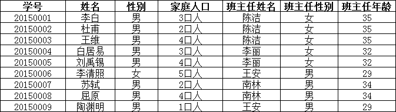
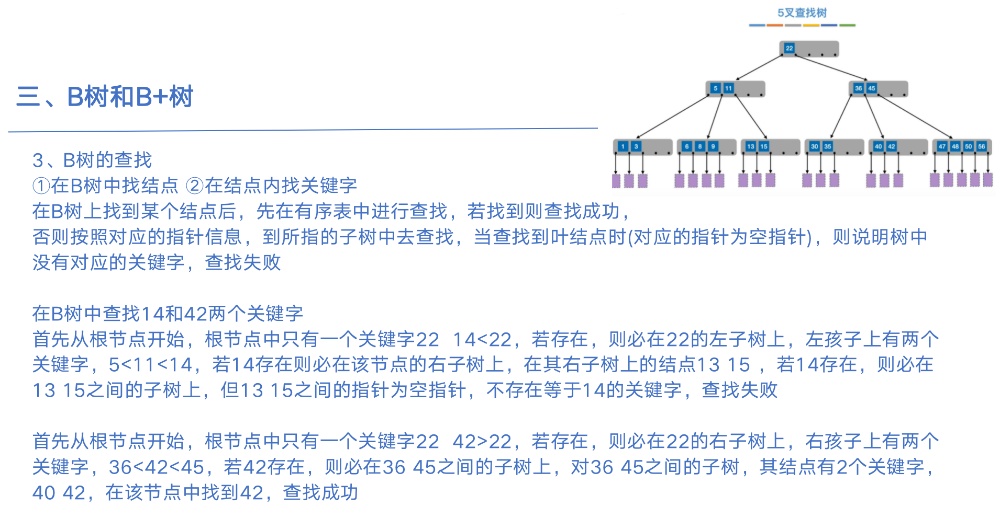
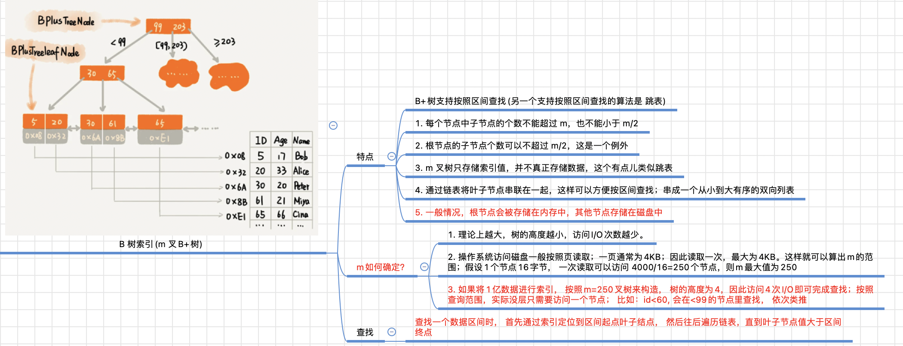

# 数据库

[LeetBook数据库知识手册](https://leetcode.cn/leetbook/read/database-handbook/phyzd2/)


## 数据库基础概念

### 什么是数据库

**数据库（Database）** 是保存有组织的数据的容器（通常是一个文件或一组文件），是通过 **数据库管理系统（DataBase- Management System，DBMS）** 创建和操纵的容器。DBMS 的主要目标是提供一种可以方便、高效地存取数据库信息的途径。

我们常说 XX 数据库，其实实质上是 XX 数据库管理系统。目前，较为流行的数据库管理系统有 MySQL、SQL Server、Oracle 等。

数据库有两种类型，分别是 **关系型数据库** 和 **非关系型数据库**。

| 数据库类型     | 定义                                                         | 优点                                                         | 缺点                                                         | 常见                                                   |
| -------------- | ------------------------------------------------------------ | ------------------------------------------------------------ | ------------------------------------------------------------ | ------------------------------------------------------ |
| 关系型数据库   | 建立在关系模型基础上，由多张能互相连接的 **表** 组成的数据库 | 1）使用表结构，格式一致，易于维护；2）使用 SQL 语句，可用于复杂查询；3）数据存储在磁盘中，安全性高 | 1）读写性能比较差；2）建立在关系模型上，不可避免空间浪费；3）固定的表结构，灵活度较低 | **MySQL**，Microsoft SQL Server，Oracle，PostgreSQL 等 |
| 非关系型数据库 | 非关系型数据库又被称为 NoSQL（Not Only SQL )，通常指数据以 **对象** 的形式存储在数据库中，而对象之间的关系通过每个对象自身的属性来决定。 | 1）存储数据的格式可以是 key-value 、文档、图片等形式，应用场景更广泛；2）可轻松进行海量数据的维护和处理；3）具有可扩展、高并发、高稳定性、成本低的优势；4）可以实现数据的分布式处理 | 1）不提供 SQL 支持；2）无事务处理，无法保证数据的完整性和安全性；3）功能没有关系型数据库完善 | Neo4j，**Redis**，MongoDB 等                           |

注：SQL 是 结构化查询语言（Structured Query Language） 的缩写，是一种数据库查询语言，用于存取数据、查询、更新和管理关系数据库系统。与其他语言（如英语以及 Java 等程序设计语言)不一样，SQL 由少量的描述性很强的词构成，简单易学。


### 为什么要使用数据库

| 数据保存方式     | 优点                                                         | 缺点                                                 |
| ---------------- | ------------------------------------------------------------ | ---------------------------------------------------- |
| 数据保存在内存   | 存取速度快                                                   | 数据无法永久保存                                     |
| 数据保存在文件   | 数据可永久保存                                               | 查询数据不方便；操作速度比内存操作慢，频繁的 IO 操作 |
| 数据保存在数据库 | 数据可永久保存且数据安全性高；使用 SQL 语句，查询方便效率高；便于数据管理、智能化数据分析 | 数据库移植不方便；不支持集群；不擅长业务逻辑的处理   |


总而言之，面对庞大的网络数据量，使用数据库可以高效且条理分明地存储数据，它使人们能够更加迅速和方便地管理数据。


### SQL 与 MySQL 有什么区别

SQL 和 MySQL 是 DBMS 中最令人困惑的两个术语，二者之间存在本质上的区别。

- SQL 是一种 **结构化查询语言**，用于在数据库上执行各种操作，但 MySQL 是一个 **关系数据库管理系统（RDBMS）**，使用 SQL 执行所有数据库操作。
- SQL 用于访问，更新和操作数据库中的数据，用户使用时需要学习该语言，然后编写查询，而 MySQL 是一个软件，会为用户提供一个界面，只需单击一些按钮即可用于执行各种数据库操作。
- 由于 MySQL 是一个软件，所以它会定期获得各种更新，但在 SQL 中，命令总是相同的。
  


### 数据库三大范式是什么

数据库范式是设计数据库时，需要遵循的一些规范。各种范式是条件递增的联系，越高的范式数据库冗余越小。常用的数据库三大范式为：

- **第一范式（1NF）**：每个列都不可以再拆分，强调的是列的原子性。第一范式要求数据库中的表都是二维表。
- **第二范式（2NF）**：在第一范式的基础上，一个表必须有一个主键，非主键列 **完全依赖** 于主键，而不能是依赖于主键的一部分。
- **第三范式（3NF）**：在第二范式的基础上，非主键列只依赖（直接依赖）于主键，不依赖于其他非主键。


这里举几个例子进行解释：

**第一范式（1NF）：列的原子性**


上表中的家庭信息不满子列的原子性，若要满足第一范式，调整如下图


调整后每个列都不可再分，故此时满足第一范式


**第二范式（2NF）：确保数据库表中的每一列都和主键相关，而不能只与主键的某一部分相关**


如上图，同一订单号存在不同产品号，同一产品号存在不同订单号。根据主键的定义，这里订单号和产品号为该表的主键，同时产品数量、产品折扣和产品价格都与订单号、产品号相关，但是订单金额和订单时间仅与订单号相关。故不满足第二范式的要求，调整如下图：


**第三范式（3NF）：确保数据表中的每一列数据都和主键直接相关，而不能间接相关。**



上表中，学号是主键，所有列完全依赖于学号，但“班主任性别”和“班主任年龄”与学号是间接相关，与班主任姓名直接相关，故不满足第三范式要求，调整如下图：


### 数据库连接泄露的含义

**数据库连接泄露**指的是如果在某次使用或者某段程序中没有正确地关闭 Connection、Statement 和 ResultSet 资源，那么每次执行都会留下一些没有关闭的连接，这些连接失去了引用而不能得到重新使用，因此就造成了数据库连接的泄漏。数据库连接的资源是宝贵而且是有限的，如果在某段使用频率很高的代码中出现这种泄漏，那么数据库连接资源将被耗尽，影响系统的正常运转。


### 什么是触发器

**触发器（trigger）**是与表相关的数据库对象，是用户定义在关系表上的一类由事件驱动的特殊的存储过程，在满足定义条件时触发，并执行触发器中定义的 **语句集合**。触发器的这种特性可以协助应用在数据库端确保 **数据库的完整性**。

**使用场景**

- 可以通过数据库中的相关表实现 **级联更改**；
- 实时监控某张表中的某个字段的更改，并需要做出相应的处理。


> 数据库中的**触发器（Triggers）**是一种数据库对象，它们与表相关联，并**在特定的数据库操作（例如插入、更新、删除）发生时自动执行一系列预定义的操作或逻辑**。触发器可以用来确保数据的完整性、执行复杂的业务规则、记录审计信息等。它们通常用于以下情况：
>
> 1. **数据完整性约束**：触发器可以用来确保数据库中的数据满足特定的完整性约束条件。例如，你可以创建一个触发器，在插入新记录之前检查一些条件，如果条件不满足，则阻止插入操作。
> 2. **记录审计**：触发器可以用于跟踪对数据库表的更改，记录谁在什么时候进行了更改，并存储这些信息以供审计目的使用。
> 3. **复杂的业务规则**：如果你有复杂的业务规则需要在数据更改时执行，触发器可以帮助你自动化这些规则的执行。
> 4. **自动化任务**：触发器可以用来触发自动化任务，例如在插入一条记录后，触发器可以自动更新其他相关的记录或表。
> 5. **数据转换**：触发器还可以用于数据转换，例如在插入数据时，自动将一些字段进行计算或格式化。
>
> 触发器通常分为两种类型：
>
> 1. **行级触发器（Row-level Triggers）**：这些触发器在每一行数据上触发，可以访问并操作正在插入、更新或删除的行。
> 2. **语句级触发器（Statement-level Triggers）**：这些触发器在执行SQL语句时触发，而不是在每一行数据上触发。它们通常用于执行与数据操作相关的任务，而不是基于特定行的逻辑。
>
> 触发器是数据库管理系统的一种高级功能，它们可以帮助确保数据的一致性和完整性，同时也提供了一种有效的方式来执行特定的数据库操作和逻辑。不过，使用触发器时需要小心，因为过多或复杂的触发器可能会增加数据库的复杂性和维护难度。因此，在设计和使用触发器时，需要谨慎考虑业务需求和性能方面的权衡。


## 索引

在面试环节中，谈及数据库问题时，不可避免地会涉及 **数据库索引** 知识，关于索引的概念、原理和意义等等问题，我们都该有所了解并掌握。本章主要介绍有关索引知识点的面试重点。

索引是一种 **数据结构**。数据库索引是 DBMS 中一个 **排序的数据结构**，以 协助快速查询、更新 数据库表中数据。索引的实现通常使用 B 树以及变种 B+ 树。

**更通俗地说，索引就相当于目录，其存在是为了方便数据内容查找，本身也占用物理空间**


### 索引的优缺点


#### 索引的优点

通过创建 **唯一性索引**，可以保证数据库表中每一行数据的唯一性；
可以加快数据的 **检索速度**，这也是创建索引的主要原因；
可以加速表和表之间的连接，特别是在实现 **数据的参考完整性** 方面特别有意义；
通过使用索引，可以在查询的过程中，使用 **优化隐藏器**，提高系统性能。


#### 索引的缺点

时间上，**创建和维护**索引都要耗费时间，这种时间随着数据量的增加而增加，具体地，当对表中的数据进行增加、删除和修改的时候，索引也要动态的维护，这样就降低了数据的维护速度；
空间上，索引需要占 **物理空间**，除了数据表占数据空间之外，每一个索引还要占一定的物理空间，如果要建立聚簇索引，那么需要的空间就会更大。


> 索引为什么可以加快查询速度？
>
> - 因为使用索引后可以不用扫描全表来定位某行的数据，而是先通过索引表找到该行数据对应的物理地址然后访问相应的数据。
> - 同时，由于索引底层实现的有序性，使得在进行数据查询时，能够避免在磁盘不同扇区的随机寻址
> - 使用索引后能够通过磁盘预读使得在磁盘上对数据的访问大致呈顺序的寻址。这本质上是依据局部性原理所实现的
>   	
>
> 总结：
>
> - 索引大大减少了服务器需要扫描的数据量		
> - 索引可以帮助服务器避免排序和临时表
> - 索引可以将随机I/O变成顺序I/O（局部性原理）


### 索引的数据结构

数据库索引根据结构分类，主要有 **B 树索引、Hash 索引 和 位图索引** 三种。


#### B 树索引

> [MySQL B+树索引](https://juejin.cn/post/6988702694160465956)
>
> 
>
> 


**B 树索引**，又称 **平衡树索引**，是 MySQL 数据库中使用最频繁的索引类型，MySQL、Oracle 和 SQL Server 数据库默认的都是 B 树索引（实际是用 B+ 树实现的，因为在查看表索引时，MySQL 一律打印 BTREE，所以简称为 B 树索引）。

B 树索引以 **树结构** 组织，它有一个或者多个分支结点，分支结点又指向单级的叶结点。其中，分支结点用于遍历树，叶结点则保存真正的值和位置信息。

B+ 树是在 B 树基础上的一种优化，使其更适合实现外存储索引结构。

**一棵 m 阶 B-Tree 的特性如下：**

- 每个结点最多 **m** 个子结点；
- 除了根结点和叶子结点外，每个结点最少有 **m/2（向上取整）**个子结点；
- 所有的叶子结点都位于同一层；
- 每个结点都包含 k 个元素（关键字），这里 **m/2≤k<m**，这里 m/2 向下取整；
- 每个节点中的元素（关键字）**从小到大排列**；
- 每个元素子左结点的值，都小于或等于该元素，右结点的值都大于或等于该元素。

数据库以 B-Tree 的数据结构存储数据的图示如下：


B+ Tree 与 B-Tree 的结构很像，但是也有自己的特性：

- 所有的非叶子结点只存储 **关键字信息**；
- 所有具体数据都存在叶子结点中；
- 所有的叶子结点中包含了全部元素的信息；
- 所有叶子节点之间都有一个链指针。

数据库以 B+ Tree 的数据结构存储数据的图示如下


#### Hash 索引

哈希索引采用一定的 **哈希算法**（常见哈希算法有 **直接定址法、平方取中法、折叠法、除数取余法、随机数法**），将数据库字段数据转换成定长的 Hash 值，与这条数据的行指针一并存入 Hash 表的对应位置，如果发生 Hash 碰撞（两个不同关键字的 Hash 值相同），则在对应 Hash 键下以 链表形式 存储。

检索时不需要类似 B+ 树那样从根节点到叶子节点逐级查找，只需一次哈希算法即可立刻定位到相应的位置，速度非常快，平均检索时间为 **O(1)**。


#### 位图索引

B 树索引擅长于处理包含许多不同值的列，但是在处理基数较小的列时会变得很难使用。如果用户查询的列的基数非常的小， 即只有几个固定值，如性别、婚姻状况、行政区等等，要么不使用索引，查询时一行行扫描所有记录，要么考虑建立位图索引。

位图索引为存储在某列中的每个值生成一个位图。例如针对表中婚姻状况这一列，生成的位图索引大致如下所示：


对于婚姻状况这一列，索引包含 3 个位图，即生成有 3 个向量，分别属于每一个取值，每个位图为每一个人（行）都分配了 0/1 值（每一行有且仅有一个 1 ），未婚为 110000……，已婚为 000111……，离婚为 001000……。

当进行数据查找时，只要查找相关位图中的所有 1 值即可（可根据查询需求进行与、或运算）。

例如， Oracle 用户可以通过为 create index 语句简单地添加关键词 bitmap 生成位图：

```
CREATE BITMAP INDEX acc_marital_idx ON account (marital_cd);
```


除了上述提及的，





### 使用 B+ 树的好处

由于 B+ 树的内部结点只存放键，不存放值，因此，一次读取，可以在同一内存页中获取更多的键，有利于更快地缩小查找范围。

B+ 树的叶结点由一条链相连，因此当需要进行一次 **全数据遍历** 的时候，B+ 树只需要使用 O(logN) 时间找到最小结点，然后通过链进行 O(N) 的顺序遍历即可；或者，在找 **大于某个关键字或者小于某个关键字的数据** 的时候，B+ 树只需要找到该关键字然后沿着链表遍历即可。


### Hash 索引和 B+ 树索引的区别

Hash 索引和 B+ 树索引有以下几点显见的区别：

- Hash 索引进行等值查询更快（一般情况下），但是却无法进行范围查询；
- Hash 索引不支持使用索引进行排序；
- Hash 索引不支持模糊查询以及多列索引的最左前缀匹配，原理也是因为 Hash 函数的不可预测；
- Hash 索引任何时候都避免不了回表查询数据，而 B+ 树在符合某些条件（聚簇索引，覆盖索引等）的时候可以只通过索引完成查询；
- Hash 索引虽然在等值查询上较快，但是不稳定，性能不可预测，当某个键值存在大量重复的时候，发生 Hash 碰撞，此时效率可能极差；而 B+ 树的查询效率比较稳定，对于所有的查询都是从根结点到叶子结点，且树的高度较低。


### 什么是前缀索引

有时需要索引很长的字符列，它会使索引变大并且变慢，一个策略就是索引开始的几个字符，而不是全部值，即被称为 **前缀索引**，以节约空间并得到好的性能。使用前缀索引的前提是 **此前缀的标识度高**，比如密码就适合建立前缀索引，因为密码几乎各不相同。

前缀索引需要的空间变小，但也会降低选择性。索引选择性（INDEX SELECTIVITY）是不重复的索引值（也叫基数）和表中所有行数（T）的比值，数值范围为 1/T ～1。高选择性的索引有好处，因为在查找匹配的时候可以过滤掉更多的行，唯一索引的选择率为 1，为最佳值。对于前缀索引而言，前缀越长往往会得到好的选择性，但是短的前缀会节约空间，所以实操的难度在于前缀截取长度的抉择，可以通过调试查看不同前缀长度的 **平均匹配度**，来选择截取长度。


> 假设在无任何索引条件下查询，
>
> ```mysql
> select * from A where name = 'x101121212.12123123'
> ```
>
> 查询时间为2.7s
>
>  
>
> 
>
> 添加一条索引(以第一位字符创建前缀索引)
>
> ```mysql
> alter table A add index(name(1))
> select * from A where name = 'x101121212.12123123'
> ```
>
> 查询时间为3.2s
>
>  
>
> 
>
> 添加一条长前缀索引(以前四位字符创建前缀索引)
>
> ```mysql
> alter table A add index(name(4))
> select * from A where name = 'x101121212.12123123'
> ```
>
> 查询时间:0.703s
> 这次以前4位创建索引 大大减少了索引值的重复性 查询速度从3秒提升到0.7秒


### 什么是最左前缀匹配原则

在 **MySQL** 建立 **联合索引（多列索引）** 时会遵守最左前缀匹配原则，即 **最左优先**，在检索数据时从联合索引的最左边开始匹配。例如有一个 3 列索引（a,b,c），则已经对（a）、（a,b）、（a,b,c）上建立了索引。所以在创建 **多列索引**时，要根据业务需求，where 子句中 **使用最频繁** 的一列放在最左边。

根据最左前缀匹配原则，MySQL 会一直向右匹配直到遇到 **范围查询**（>、<、between、like）就停止匹配，比如采用查询条件 `where a = 1 and b = 2 and c > 3 and d = 4` 时，如果建立（a,b,c,d）顺序的索引，d 是用不到索引的，如果建立（a,b,d,c）的索引则都可以用到，并且 where 子句中 a、b、d 的顺序可以任意调整。

如果建立的索引顺序是 （a,b） ，那么根据最左前缀匹配原则，直接采用查询条件 where b = 1 是无法利用到索引的。


### 添加索引的原则

索引虽好，但也不是无限制使用的，以下为添加索引时需要遵循的几项建议性原则：

- 在 **查询中很少使用** 或者参考的列不要创建索引。由于这些列很少使用到，增加索引反而会降低系统的维护速度和增大空间需求。
- **只有很少数据值的列** 也不应该增加索引。由于这些列的取值很少，区分度太低，例如人事表中的性别，在查询时，需要在表中搜索的数据行的比例很大。增加索引，并不能明显加快检索速度。
- 定义为 text、image 和 bit 数据类型的列不应该增加索引。这是因为，这些列的数据量要么相当大，要么取值很少。
- 当 **修改性能远远大于检索性能** 时，不应该创建索引。这时因为，二者是相互矛盾的，当增加索引时，会提高检索性能，但是会降低修改性能。
- 定义有 **外键** 的数据列一定要创建索引。


> 原则：查询频繁、较多数据值的列、查询远大于修改、有外键的列
> 要明确建立索引的目的是为了方便数据的查询，这样才能更好理解其原则。


### 什么是聚簇索引

**聚簇索引**，又称 **聚集索引**， 首先并不是一种索引类型，而是一种数据存储方式。具体的，聚簇索引指将 **数据存储** 和 **索引** 放到一起，找到索引也就找到了数据。

MySQL 里只有 INNODB 表支持聚簇索引，INNODB 表数据本身就是聚簇索引，非叶子节点按照主键顺序存放，叶子节点存放主键以及对应的行记录。所以对 INNODB 表进行全表顺序扫描会非常快。

#### 特点

因为索引和数据存放在一起，所以具有更高的检索效率；
相比于非聚簇索引，聚簇索引可以减少磁盘的 IO 次数；
表的物理存储依据聚簇索引的结构，所以一个数据表只能有一个聚簇索引，但可以拥有多个非聚簇索引；
一般而言，会在频繁使用、排序的字段上创建聚簇索引。

#### 非聚簇索引

除了聚簇索引以外的其他索引，均称之为非聚簇索引。非聚簇索引也是 B 树结构，与聚簇索引的存储结构不同之处在于，非聚簇索引中不存储真正的数据行，只包含一个指向数据行的指针。

就简单的 SQL 查询来看，分为 SELECT 和 WHERE 两个部分，索引的创建也是以此为根据的，分为 **复合索引** 和 **覆盖索引**。


## 事务管理

### 什么是数据库事务

数据库的 **事务（Transaction）**是一种机制、一个操作序列，包含了一组数据库操作命令，其执行的结果必须使数据库从一种一致性状态变到另一种一致性状态。事务把所有的命令作为一个整体一起向系统提交或撤销操作请求，即这一组数据库命令要么都执行，要么都不执行，因此事务是一个不可分割的工作逻辑单元。如果任意一个操作失败，那么整组操作即为失败，会回到操作前状态或者是上一个节点。

因此，事务是保持 **逻辑数据一致性** 和 **可恢复性** 的重要利器。而锁是实现事务的关键，可以保证事务的完整性和并发性


### 有哪些事务状态

事务在其整个生命周期中会经历不同的状态，这些状态也称为 **事务状态**。

- **活跃状态**：事务的第一个状态，任何正在执行的事务都处于此状态，所做的 **更改** 存储在 **主内存的缓冲区** 中。
- **部分提交状态**：执行上次操作后，事务进入部分提交状态。之所以是部分提交，是因为所做的更改仍然在主内存的缓冲区中。
- **失败状态**：如果某个检查在活动状态下失败，在活动状态或部分提交状态发生一些错误，并且事务无法进一步执行，则事务进入失败状态。
- **中止状态**：如果任何事务已达到失败状态，则恢复管理器将数据库 **回滚** 到开始执行的原始状态。
- **提交状态**：如果所有操作成功执行，则来自 **部分提交状态** 的事务进入提交状态。无法从此状态回滚，它是一个新的 **一致状态**。


### 事务的四大特性

事务具有 4 个特性，即**原子性（Atomicity）**、**一致性（Consistency）**、**隔离性（Isolation）**和**持久性（Durability）**，这 4 个特性通常简称为 ACID，**关系型数据库** 需要遵循 ACID 规则。

#### 原子性

事务是最小的执行单位，不可分割的（原子的）。事务的原子性确保动作要么全部执行，要么全部不执行。

以 **银行转账** 事务为例，如果该事务提交了，则这两个账户的数据将会更新；如果由于某种原因，事务在成功更新这两个账户之前终止了，则不会更新这两个账户的余额，并且会 **撤销** 对任何账户余额的修改，回到此操作前状态，即事务不能部分提交。


#### 一致性

当事务完成时，数据必须处于一致状态，多个事务对同一个数据读取的结果是相同的。

以银行转账事务事务为例。在事务开始之前，所有 **账户余额的总额处于一致状态**。在事务进行的过程中，一个账户余额减少了，而另一个账户余额尚未修改。因此，所有账户余额的总额处于不一致状态。但是当事务完成以后，账户余额的总额再次恢复到一致状态。


#### 隔离性

**并发访问数据库** 时，一个用户的事务不被其他事务所干扰，各个事务不干涉内部的数据。

修改数据的事务可以在另一个使用相同数据的事务开始之前访问这些数据，或者在另一个使用相同数据的事务结束之后访问这些数据。


#### 持久性

一个事务被提交之后，它对数据库中数据的改变是持久的，即使数据库发生故障也不应该对其有任何影响。


> 如何实现相应的原理
>
> - **A 原子性**:由undo log日志保证，它记录了需要回滚的日志信息，事务回滚时撤销已经执行成功的sql
> - **C 一致性**:一般由代码层面来保证
> - **I  隔离性**:由MVCC来保证
> - **D 持久性**:由内存+redo log来保证，mysql修改数据同时在内存和redo log记录这次操作，事务提交的时候通过redo log刷盘，宕机的时候可以从redo log恢复
>
>  
>
> **多版本并发控制(Multiversion concurrency control， MCC 或 MVCC)**，是数据库管理系统常用的一种并发控制，也用于程序设计语言实现事务内存。
>
> MVCC意图解决读写锁造成的多个、长时间的读操作饿死写操作问题。每个事务读到的数据项都是一个历史快照，并依赖于实现的隔离级别。写操作不覆盖已有数据项，而是创建一个新的版本，直至所在操作提交时才变为可见。快照隔离使得事务看到它启动时的数据状态。
>
>  
>
> **隔离级别：**
>
> - **读未提交**：如果一个事务已经开始写数据，其他事务不允许同时进行写操作，但是允许读此行数据。我读的时候大家想干嘛干嘛，我写的时候你只能看。（解决了更新丢失，但还是可能会出现脏读） 脏读，别人读了我正在写但没有提交的的数据
> - **读提交**：如果一个事务是读事务，则允许其他事务读写；如果是写事务，则禁止其他事务访问改数据。我读的时候大家想干嘛干嘛，我写的时候你们离我远点！（解决了更新丢失和脏读问题，但是可能出现不可重复读）
> - **可重复读**：在一个事务内，多次读同一个数据，这个事务还没结束时，其他事务不能访问该数据（包括读写），这样可以在同一个事务内两次读到的数据都是一样的。读取数据的事务会禁止其他事务写（但可以读），写事务完全禁止其他事务访问。我读的时候你们也能看，我写的时候闪开！（解决了更新丢失、脏读、不可重复读、但是还会出现幻读）
> - **串行化**：要求事务串行化执行，提供严格的事务隔离。事务只能一个接一个执行，不能并发执行。性能低代价高，一般很少使用。一个个来！（解决了更新丢失、脏读、不可重复读、幻读(虚读)）


### 如何实现事务的 ACID 特性

事务的 ACID 特性是由关系数据库管理系统来实现的。

DBMS 采用 **日志** 来保证事务的 **原子性**、**一致性** 和 **持久性**。日志记录了事务对数据库所做的更新，如果某个事务在执行过程中发生错误，就可以根据日志，撤销事务对数据库已做的更新，使数据库退回到执行事务前的初始状态。

DBMS 采用 **锁机制** 来实现事务的隔离性。当多个事务同时更新数据库中相同的数据时，只允许 **持有锁的事务** 能更新该数据，其他事务必须等待，直到前一个事务释放了锁，其他事务才有机会更新该数据。


MySQL事务的 ACID 特性主要靠三大日志来实现：

	归档日志 bin log
	回滚日志 undo log
	重做日志 redo log
	
	原子性：
		undo log日志记录sql操作，当发生回滚时，逆序执行逆操作来完成回滚
		
	持久性：
		bin log & redo log日志，
		redo log: 为了避免每次读取数据都进行磁盘IO，MySQL的InnoDB引擎采用缓存buffer方式
		redo log分为两个部分：缓冲区的redolog buffer和磁盘上的redologfile
		磁盘上的redo log不受宕机影响，在每次真正执行DML操作之前先更新redo log（称为预写式日志），也就是WAL技术
			WAL技术（Write-Ahead Logging）：在真正把数据写入到磁盘前，先记录日志
			redo log（undo log跟redo log的机制一样）都经历一次写，一次刷
				写过程将引擎用户层buffer记录的数据写入核心层buffer
				刷过程将核心层buffer数据真正写入磁盘
			由此分为三种写刷时机，同样由参数控制：延迟写 / 实时写，实时刷 / 实时写，延迟刷
			bin log有类似的刷盘时机机制，同样由参数控制：不强制要求 / 每次提交都刷盘（默认） / 集齐N次提交后刷盘
		由于redo log采用循环写的方式记录下最近的操作，但要用到更久以前的操作来完成恢复时，就需要另一种日志对更久之前的操作归档
		这个日志就是bin log, 两者要配合使用才能保证当数据库发生宕机重启时，数据不会丢失
		MySQL提交时，分为两阶段提交，第一阶段提交时，执行器先写redo log(prepare),再写bin log,第二阶段提交时正式更新redo log(commit),保证两个日志数据的安全与同步
		bin log与redo log区别：
			redo log循环写，大小固定，会丢失；bin log追加写，大小通过配置参数决定，追加写到超过文件大小后会将后续日志记录到新的bin log不丢失
			redo log 适用于崩溃恢复，只有redo log是crush-safe的；binlog 除了配合崩溃恢复保证持久性之外，还适用于主从复制（也是重点）
			bin log所有引擎都支持，server层实现，redo log仅InnoDB支持，引擎层实现
			bin log支持三种记录方式（Statement / Row / Mixed），日志类型为逻辑日志；
			redo log日志类型为物理日志（物理日志用于恢复速度会快很多）
	一致性：
		bin log 也有类似的缓冲区，binlog刷盘时机同样是靠配置参数来控制
		可以选择不实时更新，牺牲一定的一致性来换取更好的性能，默认每次提交都刷盘（保证一致性）
	隔离性：
		事务隔离级别：     	   防脏读  防不可重复读  防幻读
			read uncommitted     X          X          X
			read committed       √          X          X
			repeatable read      √          √          X
			serializable         √          √          √
			脏读：读未提交
			不可重复读：同一事务两次读的结果不同（针对update）
			幻读：前后多次读取，数据总量不一致（针对insert、delete）
		MVCC：多版本并发控制，不同事务的读–写、写–读操作并发执行，从而提升系统性能
			读未提交：就全读最新的就是读未提交，不加任何判断
			读已提交和可重复读的实现：
				核心处理逻辑就是判断所有版本中哪个版本是当前事务可见的，称为 ReadView
				这个过程通过事务IDtrx_id来判断，这个ID严格递增
				读已提交：仅判断trx_id，在本次事务之前的都有效修改，可查
				可重复读：利用undo log，配合ReadView，当该事务执行相同读操作的时候，依据undo log恢复到开始时的数据，保证永远是第一次查询时的结果	
			串行化的实现：锁实现串行化，牺牲并发，保证ACID
	注意：以上三大日志都仅记录写入性操作，不包括查询操作（因为查询不更改数据库，也就没必要记录了）


### 事务之间的相互影响

#### 脏读（Dirty Read）

一个事务读取了另一个事务未提交的数据。

#### 不可重复读（Non-repeatable Read）

就是在一个事务范围内，两次相同的查询会返回两个不同的数据，这是因为在此间隔内有其他事务对数据进行了修改。

#### 幻读（Phantom Read）

幻读是指当事务 **不是独立执行时** 发生的一种现象，例如有一个事务对表中的数据进行了修改，这种修改涉及到表中的全部数据行，同时，第一个事务也修改这个表中的数据，这种修改是向表中 **插入一行新数据**。那么，第一个事务的用户发现表中还有没有修改的数据行，就好像发生了幻觉一样。

#### 丢失更新（Lost Update）

两个事务同时读取同一条记录，事务 A 先修改记录，事务 B 也修改记录（B 是不知道 A 修改过），当 B 提交数据后， 其修改结果覆盖了 A 的修改结果，导致事务 A 更新丢失。


### 什么是事务的隔离级别

为了尽可能的避免上述事务之间的相互影响，从而达到事务的四大特性，SQL 标准定义了 4 种不同的事务隔离级别（TRANSACTION ISOLATION LEVEL），即 并发事务对同一资源的读取深度层次，由低到高依次是 读取未提交（READ-UNCOMMITTED）、读取已提交（READ-COMMITTED）、可重复读（REPEATABLE-READ）、可串行化（SERIALIZABLE），这 4 个级别与事务相互间影响问题对应如下：

| 隔离级别   | 脏读 | 不可重复读 | 幻读 | 丢失更新 |
| ---------- | ---- | ---------- | ---- | -------- |
| 读取未提交 | 是   | 是         | 是   | 是       |
| 读取已提交 | 否   | 是         | 是   | 是       |
| 可重复读   | 否   | 否         | 是   | 否       |
| 可串行化   | 否   | 否         | 否   | 否       |


- 读取未提交

​	最低的隔离级别，一个事务可以读到另一个事务未提交的结果，所有的并发事务问题都会发生。

- 读取已提交

  只有在事务提交后，其更新结果才会被其他事务看见，可以解决 脏读问题，但是不可重复读或幻读仍有可能发生。Oracle 默认采用的是该隔离级别。

- 可重复读

​	在一个事务中，对于同一份数据的读取结果总是相同的，无论是否有其他事务对这份数据进行操作，以及这个事务是否提交，除非数据	是被本身事务自己所修改。可以解决 脏读、不可重复读。MySQL 默认采用可重复读隔离级别。- 

- 可串行化

​	事务 串行化执行，隔离级别最高，完全服从 ACID，牺牲了系统的并发性，也就是说，所有事务依次逐个执行，所以可以解决并发事务的	所有问题。


## 阶段测

### 简答题

1. 数据库是什么？

   数据库是保存有组织的数据的容器（通常是一个文件或一组文件），是通过 数据库管理系统创建和操纵的容器。

   

2. DBMS 的主要目标是什么？

   提供一种可以方便、高效地存取数据库信息的途径。


3. 数据库有哪几种类型？
   关系型数据库和非关系型数据库。

   


4. 数据保存在内存的优点和缺点分别是什么？
   优点是存取速度快，缺点是数据无法永久保存。

   


5. SQL 与 MySQL 是关系数据库管理系统的是？
   MySQL。

   


6. 第三范式（3NF）与第二范式的区别是什么？
   在第二范式的基础上，非主键列只依赖（直接依赖）于主键，不依赖于其他非主键。

   


7. 触发器的使用场景有哪些？
   • 可以通过数据库中的相关表实现 级联更改；
   • 实时监控某张表中的某个字段的更改，并需要做出相应的处理。

   


8. 数据库索引根据结构分为哪几类？
   主要有 B 树索引、Hash 索引 和 位图索引 三种。

   


9. B+ Tree 与 B-Tree 的结构很像，但是也有自己的特性，它的有哪些？
   • 所有的非叶子结点只存储 关键字信息；
   • 所有具体数据都存在叶子结点中；
   • 所有的叶子结点中包含了全部元素的信息；
   • 所有叶子节点之间都有一个链指针。

   


10. Hash 索引和 B+ 树索引哪个不支持模糊查询以及多列索引的最左前缀匹配？为什么？
    Hash 索引。因为 Hash 函数的不可预测。

    


11. Hash 索引和 B+ 树索引中，必须回表查询数据的是？
    Hash索引。

    


12. 使用前缀索引的前提是什么？
    此前缀的标识度高。

    


13. 在创建 多列索引时，要根据业务需求，什么放在最左边？

    where 子句中 使用最频繁 的一列。

    

14. 添加索引时需要注意哪些原则？
    • 在查询中很少使用或者参考的列不要创建索引。
    • 只有很少数据值的列 也不应该增加索引。
    • 定义为 text、image 和 bit 数据类型的列不应该增加索引。
    • 当 修改性能远远大于检索性能 时，不应该创建索引。
    • 定义有 外键 的数据列一定要创建索引。

    


15. 非聚簇索引分为哪两类？分别是什么意思？
    • 覆盖索引：索引中包含SELECT数据字段
    • 复合索引：索引中包含多个WHERE条件字段

    


16. 什么是数据库事务？
    数据库的事务是一种机制、一个操作序列，包含了一组数据库操作命令，其执行的结果必须使数据库从一种一致性状态变到另一种一致性状态。

    


17. 什么是实现事务的关键，可以保证事务的完整性和并发性？
    锁。

    


18. 事务具有哪 4 个特性？
    原子性、一致性、隔离性、持久性。

    


19. DBMS 采用什么来保证事务的原子性、一致性和持久性？

    日志。

    

20. DBMS 采用什么来实现事务的隔离性？
    锁机制。

    


21. 什么是脏读？
    一个事务读取了另一个事务未提交的数据。

    


22. 请由低到高依次写出事物的隔离级别。
    读取未提交、读取已提交、可重复读、可串行化。

    


23. 可重复读在读取已提交的基础上解决了哪两个问题？
    不可重复读、丢失更新


## 锁

在上一章中，提及事务之间的相互影响时，介绍了脏读、幻读等几种类型的数据错误，为更好避免发生这些错误，引入了对资源的锁定。锁定的存在使得一个事务对他自己的数据块进行操作时，另外一个事务不能插足这个数据块。


### 锁的分类

从数据库系统的角度，锁模式可分为以下6 种类型：

#### 共享锁（S）

又叫 他读锁。可以并发读取数据，但不能修改数据。也就是说当数据资源上存在共享锁时，所有的事务都不能对该数据进行修改，直到数据读取完成，共享锁释放。

#### 排它锁（X）

又叫 独占锁、写锁。对数据资源进行增删改操作时，不允许其它事务操作这块资源，直到排它锁被释放，从而防止同时对同一资源进行多重操作。

#### 更新锁（U）

防止出现 **死锁** 的锁模式，两个事务对一个数据资源进行先读取再修改的情况下，使用共享锁和排它锁有时会出现死锁现象，而使用更新锁就可以避免死锁的出现。

**资源的更新锁一次只能分配给一个事务，如果需要对资源进行修改，更新锁会变成排它锁，否则变为共享锁。**

#### 意向锁

表示 SQL Server 需要在 **层次结构中的某些底层资源上** 获取共享锁或排它锁。例如，放置在 表级 的 共享意向锁 表示事务打算在表中的页或行上放置共享锁。在表级设置意向锁可防止另一个事务随后在包含那一页的表上获取排它锁。

意向锁可以提高性能，因为 SQL Server 仅在 表级 检查意向锁来确定事务是否可以安全地获取该表上的锁，而无须检查表中的每行或每页上的锁以确定事务是否可以锁定整个表。

意向锁包括意向共享 (IS)、意向排它 (IX) 以及与意向排它共享 (SIX)。

#### 架构锁

在执行 依赖于表架构的操作 时使用。架构锁的类型为：架构修改 (Sch-M) 和架构稳定性 (Sch-S)，执行表的数据定义语言 （DDL）操作（例如添加列或除去表）时使用架构修改锁，当编译查询时，使用架构稳定性锁。

#### 大容量更新锁（BU）

向表中大容量复制数据并指定了 TABLOCK 提示时使用。 大容量更新锁允许进程将数据并发地大容量复制到同一表，同时防止其它不进行大容量复制数据的进程访问该表。


